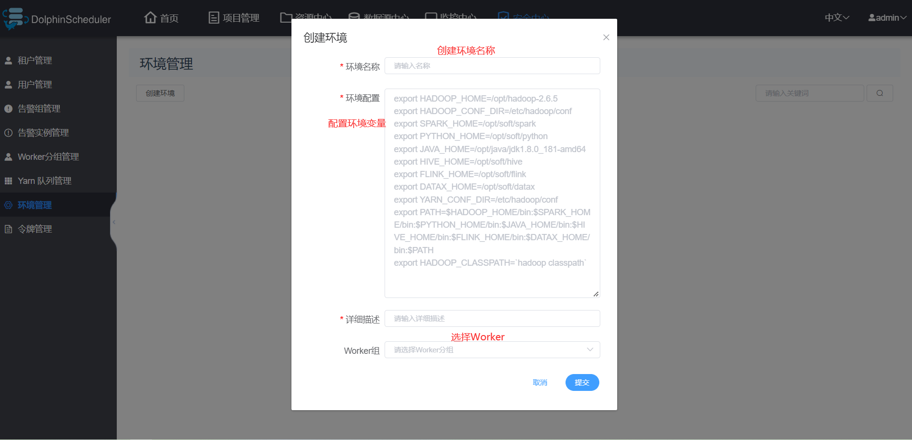

# DolphinScheduler入门到精通

## DolphinScheduler简介

 *Apache DolphinScheduler是一个分布式易扩展的可视化DAG工作流任务调度开源系统。解决数据研发ETL 错综复杂的依赖关系，不能直观监控任务健康状态等问题。DolphinScheduler以DAG流式的方式将Task组装起来，可实时监控任务的运行状态，同时支持重试、从指定节点恢复失败、暂停及Kill任务等操作* 

 ***Apache DolphinScheduler是一个分布式去中心化，易扩展的可视化DAG工作流任务调度平台。致力于解决数据处理流程中错综复杂的依赖关系，使调度系统在数据处理流程中开箱即用。它是一个分布式易扩展的可视化工作流任务调度平台*** 


## 特点&优势

### 简单易用

*DAG监控界面，所有流程定义都是可视化，通过拖拽任务定制DAG，通过API方式与第三方系统对接, 一键部署。*

### 高可靠性

*去中心化的多Master和多Worker, 自身支持HA功能, 采用任务队列来避免过载，不会造成机器卡死。*

### 丰富的使用场景

*支持暂停恢复操作.支持多租户，更好的应对大数据的使用场景. 支持更多的任务类型，如 spark, hive, mr, python, sub_process, shell。*

### 高扩展性

*支持自定义任务类型，调度器使用分布式调度，调度能力随集群线性增长，Master和Worker支持动态上下线。*

## 环境配置建议

*DolphinScheduler 作为一款开源分布式工作流任务调度系统，可以很好地部署和运行在 Intel 架构服务器及主流虚拟化环境下，并支持主流的Linux操作系统环境。*

### Linux 操作系统版本要求

|        *操作系统*        |    *版本*    |
| :----------------------: | :----------: |
| Red Hat Enterprise Linux |  7.0 及以上  |
|          CentOS          |  7.0 及以上  |
| Oracle Enterprise Linux  |  7.0 及以上  |
|        Ubuntu LTS        | 16.04 及以上 |

> **注意：** 以上 Linux 操作系统可运行在物理服务器以及 VMware、KVM、XEN 主流虚拟化环境上

### 服务器配置建议

*DolphinScheduler 支持运行在 Intel x86-64 架构的 64 位通用硬件服务器平台。对生产环境的服务器硬件配置有以下建议：* 

**生产环境：**

| ***CPU*** | ***内存*** | ***硬盘类型*** | ***网络*** | ***实例数量*** |
| :-------: | :--------: | :------------: | :--------: | :------------: |
|   4核+    |   8 GB+    |      SAS       |  千兆网卡  |       1+       |

> **注意：**
>
> - 以上建议配置为部署 DolphinScheduler 的最低配置，生产环境强烈推荐使用更高的配置
> - 硬盘大小配置建议 50GB+ ，系统盘和数据盘分开

### 端口说明

*DolphinScheduler正常运行提供如下的网络端口配置：* 

|        *组件*        | *默认端口* |               *说明*               |
| :------------------: | :--------: | :--------------------------------: |
|     MasterServer     |    5678    | 非通信端口，只需本机端口不冲突即可 |
|     WorkerServer     |    1234    | 非通信端口，只需本机端口不冲突即可 |
| ApiApplicationServer |   12345    |          提供后端通信端口          |

> **注意：**
>
> - MasterServer 和 WorkerServer 不需要开启网络间通信，只需本机端口不冲突即可
> - 管理员可根据实际环境中 DolphinScheduler 组件部署方案，在网络侧和主机侧开放相关端口

### 客户端 Web 浏览器要求

*DolphinScheduler 推荐 Chrome 以及使用 Chromium 内核的较新版本浏览器访问前端可视化操作界面* 


## 安装教程

### 下载步骤

1、DolphinScheduler[下载地址](https://dolphinscheduler.apache.org/zh-cn/download/download.html)：**只有源码包属于Apache官方发布包，二进制发布包只是为了方便用户使用。**

2、如果网速很慢，可选择[镜像下载](https://mirrors.tuna.tsinghua.edu.cn/apache/dolphinscheduler/)。

3、只需下载二进制安装包即可。

**DolphinScheduler：**


### 安装教程

#### 部署单机模式

**1、前置准备工作**

- JDK：下载[JDK](https://www.oracle.com/technetwork/java/javase/downloads/index.html) (1.8+)，并将 `JAVA_HOME` 配置到以及 `PATH` 变量中。
- 二进制包：在[下载页面](https://mirrors.tuna.tsinghua.edu.cn/apache/dolphinscheduler/)下载 DolphinScheduler 二进制包


**2、解压安装**

2.1、上传二进制安装包


2.2、解压到安装目录

```shell
# 解压到/opt/module目录下
tar -zxvf apache-dolphinscheduler-2.0.5-bin.tar.gz -C /opt/module/dolphinscheduler
```


```shell
# 修改名字为dolphinscheduler
mv apache-dolphinscheduler-2.0.5-bin/ dolphinscheduler
```


2.3、进入到bin脚本目录

```shell
# 进入到安装目录 
# 注意：不需要进入dolphinscheduler/bin目录下面
cd dolphinscheduler/

# 通过脚本启动dolphinscheduler
sh ./bin/dolphinscheduler-daemon.sh start standalone-server

# 通过jps查看进程
jps
```


2.4、启动浏览器界面

```shell
# 我的主机名为hadoop01
http://hadoop01:12345/dolphinscheduler
```

 浏览器访问地址 http://hadoop01:12345/dolphinscheduler 即可登录系统UI。默认的用户名和密码是 **admin/dolphinscheduler123** 


2.5、登录界面


*进入到此页面，说明已成功进入浏览器*


2.6、启动停止服务

脚本 `./bin/dolphinscheduler-daemon.sh` 除了可以快捷启动 standalone 外，还能停止服务运行，全部命令如下：

```shell
# 启动 Standalone Server 服务
sh ./bin/dolphinscheduler-daemon.sh start standalone-server

# 停止 Standalone Server 服务
sh ./bin/dolphinscheduler-daemon.sh stop standalone-server
```

*2.7、以上完成了dolphinscheduler standalone模式的搭建*

## Dolphinscheduler快速入门

###  管理员用户登录 

 地址：http://hadoop01:12345/dolphinscheduler 用户名密码：admin/dolphinscheduler123 


## 进入首页

可查看任务状态和流程统计状态


### 租户管理

创建操作系统租户


### 用户管理

创建普通登录用户


### 创建告警组


### 创建告警实列


### 创建Worker分组


### 创建Yarn队列管理


### 创建环境管理



### 创建令牌管理


### 创建第一个项目


