# DolphinScheduler入门到精通

## DolphinScheduler简介

 *Apache DolphinScheduler是一个分布式易扩展的可视化DAG工作流任务调度开源系统。解决数据研发ETL 错综复杂的依赖关系，不能直观监控任务健康状态等问题。DolphinScheduler以DAG流式的方式将Task组装起来，可实时监控任务的运行状态，同时支持重试、从指定节点恢复失败、暂停及Kill任务等操作* 

 ***Apache DolphinScheduler是一个分布式去中心化，易扩展的可视化DAG工作流任务调度平台。致力于解决数据处理流程中错综复杂的依赖关系，使调度系统在数据处理流程中开箱即用。它是一个分布式易扩展的可视化工作流任务调度平台*** 

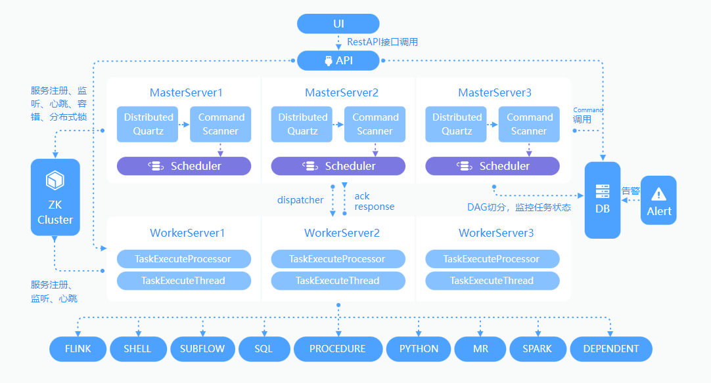

## 特点&优势

### 简单易用

*DAG监控界面，所有流程定义都是可视化，通过拖拽任务定制DAG，通过API方式与第三方系统对接, 一键部署。*

### 高可靠性

*去中心化的多Master和多Worker, 自身支持HA功能, 采用任务队列来避免过载，不会造成机器卡死。*

### 丰富的使用场景

*支持暂停恢复操作.支持多租户，更好的应对大数据的使用场景. 支持更多的任务类型，如 spark, hive, mr, python, sub_process, shell。*

### 高扩展性

*支持自定义任务类型，调度器使用分布式调度，调度能力随集群线性增长，Master和Worker支持动态上下线。*

## 环境配置建议

*DolphinScheduler 作为一款开源分布式工作流任务调度系统，可以很好地部署和运行在 Intel 架构服务器及主流虚拟化环境下，并支持主流的Linux操作系统环境。*

### Linux 操作系统版本要求

|        *操作系统*        |    *版本*    |
| :----------------------: | :----------: |
| Red Hat Enterprise Linux |  7.0 及以上  |
|          CentOS          |  7.0 及以上  |
| Oracle Enterprise Linux  |  7.0 及以上  |
|        Ubuntu LTS        | 16.04 及以上 |

> **注意：** 以上 Linux 操作系统可运行在物理服务器以及 VMware、KVM、XEN 主流虚拟化环境上

### 服务器配置建议

*DolphinScheduler 支持运行在 Intel x86-64 架构的 64 位通用硬件服务器平台。对生产环境的服务器硬件配置有以下建议：* 

**生产环境：**

| ***CPU*** | ***内存*** | ***硬盘类型*** | ***网络*** | ***实例数量*** |
| :-------: | :--------: | :------------: | :--------: | :------------: |
|   4核+    |   8 GB+    |      SAS       |  千兆网卡  |       1+       |

> **注意：**
>
> - 以上建议配置为部署 DolphinScheduler 的最低配置，生产环境强烈推荐使用更高的配置
> - 硬盘大小配置建议 50GB+ ，系统盘和数据盘分开

### 端口说明

*DolphinScheduler正常运行提供如下的网络端口配置：* 

|        *组件*        | *默认端口* |               *说明*               |
| :------------------: | :--------: | :--------------------------------: |
|     MasterServer     |    5678    | 非通信端口，只需本机端口不冲突即可 |
|     WorkerServer     |    1234    | 非通信端口，只需本机端口不冲突即可 |
| ApiApplicationServer |   12345    |          提供后端通信端口          |

> **注意：**
>
> - MasterServer 和 WorkerServer 不需要开启网络间通信，只需本机端口不冲突即可
> - 管理员可根据实际环境中 DolphinScheduler 组件部署方案，在网络侧和主机侧开放相关端口

### 客户端 Web 浏览器要求

*DolphinScheduler 推荐 Chrome 以及使用 Chromium 内核的较新版本浏览器访问前端可视化操作界面* 

## 安装教程

### 下载步骤

1、DolphinScheduler[下载地址](https://dolphinscheduler.apache.org/zh-cn/download/download.html)：**只有源码包属于Apache官方发布包，二进制发布包只是为了方便用户使用。**

2、如果网速很慢，可选择[镜像下载](https://mirrors.tuna.tsinghua.edu.cn/apache/dolphinscheduler/)。

3、只需下载二进制安装包即可。

**DolphinScheduler：**

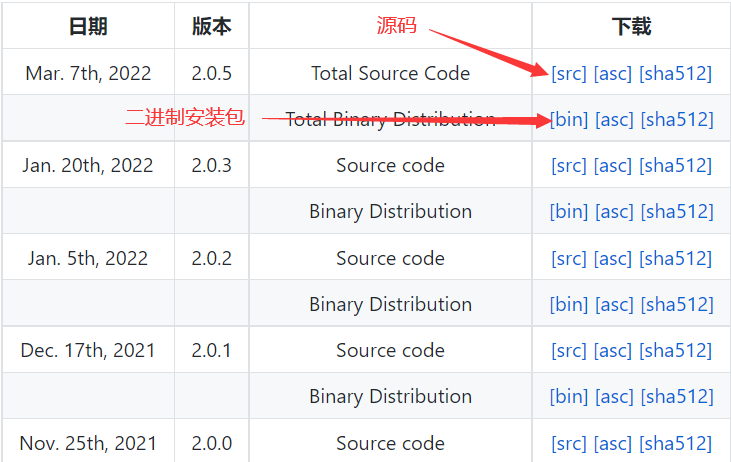

## 单机模式standalone

### 1、前置准备工作

- JDK：下载[JDK](https://www.oracle.com/technetwork/java/javase/downloads/index.html) (1.8+)，并将 `JAVA_HOME` 配置到以及 `PATH` 变量中。
- 二进制包：在[下载页面](https://mirrors.tuna.tsinghua.edu.cn/apache/dolphinscheduler/)下载 DolphinScheduler 二进制包

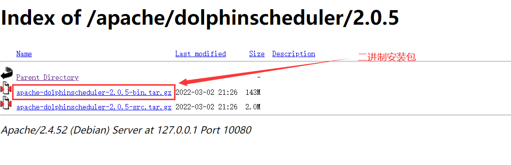


### 2、解压安装

2.1、上传二进制安装包

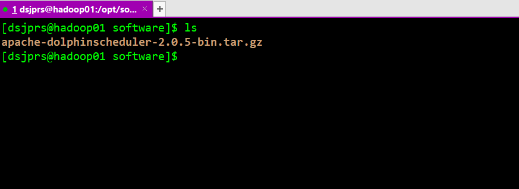

### 2.2、解压到安装目录

```shell
# 解压到/opt/module目录下
tar -zxvf apache-dolphinscheduler-2.0.5-bin.tar.gz -C /opt/module/dolphinscheduler
```


```shell
# 修改名字为dolphinscheduler
mv apache-dolphinscheduler-2.0.5-bin/ dolphinscheduler
```


### 2.3、进入到bin脚本目录

```shell
# 进入到安装目录 
# 注意：不需要进入dolphinscheduler/bin目录下面
cd dolphinscheduler/

# 通过脚本启动dolphinscheduler
sh ./bin/dolphinscheduler-daemon.sh start standalone-server

# 通过jps查看进程
jps
```


### 2.4、启动浏览器界面

```shell
# 主机名为hadoop01或者主机ip
http://hadoop01:12345/dolphinscheduler
```

 浏览器访问地址 http://hadoop01:12345/dolphinscheduler 即可登录系统UI。默认的用户名和密码是 **admin/dolphinscheduler123** 


### 2.5、登录界面


*进入到此页面，说明已成功进入浏览器*


### 2.6、启动停止服务

脚本 `./bin/dolphinscheduler-daemon.sh` 除了可以快捷启动 standalone 外，还能停止服务运行，全部命令如下：

```shell
# 启动 Standalone Server 服务
sh ./bin/dolphinscheduler-daemon.sh start standalone-server

# 停止 Standalone Server 服务
sh ./bin/dolphinscheduler-daemon.sh stop standalone-server
```

*以上完成了dolphinscheduler standalone模式的搭建*

## 伪集群部署

伪集群部署目的是在单台机器部署 DolphinScheduler 服务，该模式下master、worker、api server、logger server都在同一台机器上。

### 准备工作

伪分布式部署 DolphinScheduler 需要有外部软件的支持

- JDK：下载[JDK](https://www.oracle.com/technetwork/java/javase/downloads/index.html) (1.8+)，并将 JAVA_HOME 配置到以及 PATH 变量中。如果你的环境中已存在，可以跳过这步。
- 二进制包：在[下载页面](https://mirrors.tuna.tsinghua.edu.cn/apache/dolphinscheduler/)下载 DolphinScheduler 二进制包
- 数据库：[PostgreSQL](https://www.postgresql.org/download/) (8.2.15+) 或者 [MySQL](https://dev.mysql.com/downloads/mysql/) (5.7+)，两者任选其一即可，如 MySQL 则需要 JDBC Driver 8.0.16
- 注册中心：[ZooKeeper](https://zookeeper.apache.org/releases.html) (3.4.6+)，[下载地址](https://zookeeper.apache.org/releases.html)
- 进程树分析
  - macOS安装`pstree`
  - Fedora/Red/Hat/CentOS/Ubuntu/Debian安装`psmisc`

>  **注意:** DolphinScheduler 本身不依赖 Hadoop、Hive、Spark，但如果运行的任务需要依赖他们，就需要有对应的环境支持 

### 准备 DolphinScheduler 启动环境

### 创建用户免密及权限

 创建部署用户，并且一定要配置 `sudo` 免密。以创建 dsjprs 用户为例 

```shell
# 创建用户需使用 root 登录
useradd dolphinscheduler

# 添加密码
echo "dolphinscheduler" | passwd --stdin dolphinscheduler

# 配置 sudo 免密
sed -i '$adolphinscheduler  ALL=(ALL)  NOPASSWD: NOPASSWD: ALL' /etc/sudoers
sed -i 's/Defaults    requirett/#Defaults    requirett/g' /etc/sudoers

# 修改目录权限，使得部署用户对二进制包解压后的 apache-dolphinscheduler-*-bin 目录有操作权限
chown -R dolphinscheduler:dolphinscheduler dolphinscheduler
```

> **注意:**
>
> - 因为任务执行服务是以 `sudo -u {linux-user}` 切换不同 linux 用户的方式来实现多租户运行作业，所以部署用户需要有 sudo 权限，而且是免密的。
> - 如果发现 `/etc/sudoers` 文件中有 "Defaults requirett" 这行，也请注释掉

### 配置SSH免密登陆

 由于安装的时候需要向不同机器发送资源，所以要求各台机器间能实现SSH免密登陆。配置免密登陆的步骤如下:

```shell
su dolphinscheduler

ssh-keygen -t rsa -P '' -f ~/.ssh/id_rsa
cat ~/.ssh/id_rsa.pub >> ~/.ssh/authorized_keys
chmod 600 ~/.ssh/authorized_keys
```

>  **注意:** 配置完成后，可以通过运行命令 `ssh localhost` 判断是否成功，如果不需要输入密码就能ssh登陆则证明成功 

### 启动zookeeper

 进入 zookeeper 的安装目录，将 `zoo_sample.cfg` 配置文件复制到 `conf/zoo.cfg`，并将 `conf/zoo.cfg` 中 dataDir 中的值改成 dataDir= 自己的数据存放目录即可。如已安装过，跳过。

 ```shell
# 启动 zookeeper // 如果安装的为分布式，则启动三台
./bin/zkServer.sh start
 ```

### 修改相关配置

完成了基础环境的准备后，在运行部署命令前，还需要根据环境修改配置文件。配置文件在路径在`conf/config/install_config.conf`下，一般部署只需要修改**INSTALL MACHINE、DolphinScheduler ENV、Database、Registry Server**部分即可完成部署，下面对必须修改参数进行说明:`编辑install_config.conf`

```shell
vim conf/config/install_config.conf
```

```shell
# ---------------------------------------------------------
# INSTALL MACHINE
# ---------------------------------------------------------
# 因为是在单节点上部署master、worker、API server，所以服务器的IP均为机器IP或者localhost
ips="hadoop01"
masters="hadoop01"
workers="hadoop01:default"
alertServer="hadoop01"
apiServers="hadoop01"
pythonGatewayServers="hadoop01"

# DolphinScheduler安装路径，如果不存在会创建
installPath="~/dolphinscheduler"

# 部署用户，填写在 **配置用户免密及权限** 中创建的用户
deployUser="dsjprs"

# ---------------------------------------------------------
# DolphinScheduler ENV
# ---------------------------------------------------------
# JAVA_HOME 的路径，是在 **前置准备工作** 安装的JDK中 JAVA_HOME 所在的位置
javaHome="/opt/module/java/jdk1.8"

# ---------------------------------------------------------
# Database
# ---------------------------------------------------------
# 数据库的类型，用户名，密码，IP，端口，元数据库db。其中 DATABASE_TYPE 目前支持 mysql, postgresql, H2
# 请确保配置的值使用双引号引用，否则配置可能不生效
DATABASE_TYPE="mysql"
SPRING_DATASOURCE_URL="jdbc:mysql://hadoop01:3306/dolphinscheduler?useUnicode=true&characterEncoding=UTF-8"
# 如果你不是以 dolphinscheduler/dolphinscheduler 作为用户名和密码的，需要进行修改
SPRING_DATASOURCE_USERNAME="root"
SPRING_DATASOURCE_PASSWORD="123456"

# ---------------------------------------------------------
# Registry Server
# ---------------------------------------------------------
# 注册中心地址，zookeeper服务的地址
registryServers="hadoop01:2181,hadoop02:2181,hadoop03:2181"
```

### 初始化数据库

DolphinScheduler 元数据存储在关系型数据库中，目前支持 PostgreSQL 和 MySQL，如果使用 MySQL 则需要手动下载 [mysql-connector-java 驱动](https://downloads.mysql.com/archives/c-j/) (8.0.16) 并移动到 DolphinScheduler 的 lib目录下。

下面以 MySQL 为例，说明如何初始化数据库: 

```mysql
mysql -uroot -p

mysql> CREATE DATABASE dolphinscheduler DEFAULT CHARACTER SET utf8 DEFAULT COLLATE utf8_general_ci;

# 修改 {user} 和 {password} 为你希望的用户名和密码
mysql> GRANT ALL PRIVILEGES ON dolphinscheduler.* TO '{root}'@'%' IDENTIFIED BY '{123456}';
mysql> GRANT ALL PRIVILEGES ON dolphinscheduler.* TO '{root}'@'localhost' IDENTIFIED BY '{123456}';

mysql> flush privileges;
```

注意：如果出现 ERROR 1819 (HY000): Your password does not satisfy the current policy requirements 

**原因是因为密码设置的过于简单会报错,MySQL有密码设置的规范，具体是与validate_password_policy的值有关,下图表明该值规则**:

**查看MySQL完整的初始密码规则,登陆后执行以下命令** 

```sql
SHOW VARIABLES LIKE 'validate_password%';
```


**密码的长度是由validate_password_length决定的,可以通过以下命令修改** 

```sql
set global validate_password_length=6;
```

 **validate_password_policy决定密码的验证策略,默认等级为MEDIUM(中等)**

**可通过以下命令修改为LOW(低)**:

```sql
set global validate_password_policy=0;
```

完成上述步骤后，已经为 DolphinScheduler 创建一个新数据库，可以通过快速的 Shell 脚本来初始化数据库：

```shell
sh script/create-dolphinscheduler.sh
```

### 启动 DolphinScheduler

 使用上面创建的**部署用户**运行以下命令完成部署，部署后的运行日志将存放在 logs 文件夹内 

```shell
sh install.sh
```

>  **注意:** 第一次部署的话，可能出现 5 次`sh: bin/dolphinscheduler-daemon.sh: No such file or directory`相关信息，次为非重要信息直接忽略即可 

### 登录 DolphinScheduler

浏览器访问地址 http://hadoop01:12345/dolphinscheduler 即可登录系统UI。默认的用户名和密码是 **admin/dolphinscheduler123** 


### 启停服务

```shell
# 一键停止集群所有服务
sh ./bin/stop-all.sh

# 一键开启集群所有服务
sh ./bin/start-all.sh

# 启停 Master
sh ./bin/dolphinscheduler-daemon.sh stop master-server
sh ./bin/dolphinscheduler-daemon.sh start master-server

# 启停 Worker
sh ./bin/dolphinscheduler-daemon.sh start worker-server
sh ./bin/dolphinscheduler-daemon.sh stop worker-server

# 启停 Api
sh ./bin/dolphinscheduler-daemon.sh start api-server
sh ./bin/dolphinscheduler-daemon.sh stop api-server

# 启停 Logger
sh ./bin/dolphinscheduler-daemon.sh start logger-server
sh ./bin/dolphinscheduler-daemon.sh stop logger-server

# 启停 Alert
sh ./bin/dolphinscheduler-daemon.sh start alert-server
sh ./bin/dolphinscheduler-daemon.sh stop alert-server

# 启停 Python Gateway
sh ./bin/dolphinscheduler-daemon.sh start python-gateway-server
sh ./bin/dolphinscheduler-daemon.sh stop python-gateway-server
```

## 分布式集群安装

二进制包：在[下载页面](https://mirrors.tuna.tsinghua.edu.cn/apache/dolphinscheduler/)下载 DolphinScheduler 二进制包

1、解压，重命名

```shell
tar -zxvf apache-dolphinscheduler-1.3.9-bin.tar.gz -C /opt/module/

mv apache-dolphinscheduler-1.3.9-bin/ dolphinscheduler
```

2、 将MySQL的驱动包放到dolphinscheduler-bin/lib目录下(使用超链接的方式) 

```shell
ln -s /opt/module/hive/lib/mysql-connector-java-5.1.37.jar /opt/module/dolphinscheduler/lib/
```

3、 在MySQL中创建dolphinscheduler数据库 

```sql
mysql -uroot -p

mysql> CREATE DATABASE dolphinscheduler DEFAULT CHARACTER SET utf8 DEFAULT COLLATE utf8_general_ci;

# 修改 {user} 和 {password} 为你希望的用户名和密码
mysql> GRANT ALL PRIVILEGES ON dolphinscheduler.* TO '{root}'@'%' IDENTIFIED BY '{123456}';
mysql> GRANT ALL PRIVILEGES ON dolphinscheduler.* TO '{root}'@'localhost' IDENTIFIED BY '{123456}';

mysql> flush privileges;
```

4、 修改dolphinscheduler-bin/conf/datasource.properties配置文件,将数据库改为mysql(默认是postgresql) 

```shell
# 1.3.9之前的版本需要在此文件进行配置
vim conf/datasource.properties
```

```shell
#mysql

spring.datasource.driver-class-name=com.mysql.jdbc.Driver 

spring.datasource.url=jdbc:mysql://hadoop01:3306/dolphinscheduler?useUnicode=true&characterEncoding=UTF-8&allowMultiQueries=true

spring.datasource.username=root

spring.datasource.password=12345678
```

5、执行脚本

```sql
sh script/create-dolphinscheduler.sh
```

6、 修改运行时的参数(即conf/env/dolphinscheduler_env.sh文件) 

```shell
vim conf/env/dolphinscheduler_env.sh
```

```sql
#根据自身实际情况设置,暂时用不到的组件可以先注释掉或不设置

export HADOOP_HOME=/opt/servers/hadoop-2.9.2/

export HADOOP_CONF_DIR=/opt/servers/hadoop-2.9.2/etc/hadoop

#export SPARK_HOME2=/opt/servers/spark-2.4.1

#export PYTHON_HOME=/opt/soft/python

export JAVA_HOME=/opt/servers/jdk1.8.0_231/

#export HIVE_HOME=/opt/servers/hive-2.3.7/

#export FLINK_HOME=/opt/servers/flink-1.10

#export DATAX_HOME=/opt/servers/datax/bin/datax.py

export PATH=$HADOOP_HOME/bin:$JAVA_HOME/bin:$HIVE_HOME/bin:$PATH 
```

7、 在准备安装ds的所有节点上执行下面的命令(将java命令超链接到自己安装的jdk下) 

```shell
sudo ln -s /opt/module/java/jdk1.8/bin/java /usr/bin/java
```

 **说明:**如果/usr/bin/java已经存在,先删除掉,重新建立超链接. 

8、 修改一键部署的相关配置文件(具体内容根据自己的实际规划进行修改) 

```shell
vim conf/config/install_config.conf
```

```shell
# 本教程版本为2.0.5 根据自身需要，进行配置的修改
# ---------------------------------------------------------
# INSTALL MACHINE
# ---------------------------------------------------------
# A comma separated list of machine hostname or IP would be installed DolphinScheduler,
# including master, worker, api, alert. If you want to deploy in pseudo-distributed
# mode, just write a pseudo-distributed hostname
# Example for hostnames: ips="ds1,ds2,ds3,ds4,ds5", Example for IPs: #ips="192.168.8.1,192.168.8.2,192.168.8.3,192.168.8.4,192.168.8.5"
# 配置主机IP
ips="hadoop01,hadoop02,hadoop03"

# Port of SSH protocol, default value is 22. For now we only support same port in all `ips` machine
# modify it if you use different ssh port
sshPort="22"

# A comma separated list of machine hostname or IP would be installed Master server, it
# must be a subset of configuration `ips`.
# Example for hostnames: masters="ds1,ds2", Example for IPs: masters="192.168.8.1,192.168.8.2"
# master安装的机器主机名
masters="hadoop01,hadoop02"

# A comma separated list of machine <hostname>:<workerGroup> or <IP>:<workerGroup>.All hostname or IP must be a
# subset of configuration `ips`, And workerGroup have default value as `default`, but we recommend you declare behind the hosts
# Example for hostnames: workers="ds1:default,ds2:default,ds3:default", Example for IPs: workers="192.168.8.1:default,192.168.8.2:default,192.168.8.3:default"
# worker服务主机安装在那些机器上
workers="hadoop02:default,hadoop03:defalut"

# A comma separated list of machine hostname or IP would be installed Alert server, it
# must be a subset of configuration `ips`.
# Example for hostname: alertServer="ds3", Example for IP: alertServer="192.168.8.3"
# 警告通知安装的机器，需要使用到mysql
alertServer="hadoop01"

# A comma separated list of machine hostname or IP would be installed API server, it
# must be a subset of configuration `ips`.
# Example for hostname: apiServers="ds1", Example for IP: apiServers="192.168.8.1"
# api服务机器
apiServers="hadoop02"

# A comma separated list of machine hostname or IP would be installed Python gateway server, it
# must be a subset of configuration `ips`.
# Example for hostname: pythonGatewayServers="ds1", Example for IP: pythonGatewayServers="192.168.8.1"
pythonGatewayServers="hadoop03"

# The directory to install DolphinScheduler for all machine we config above. It will automatically be created by `install.sh` script if not exists.
# Do not set this configuration same as the current path (pwd)
# 安装的路径，因为需要执行 sh install.sh脚本
installPath="/opt/module/dolphinscheduler"

# The user to deploy DolphinScheduler for all machine we config above. For now user must create by yourself before running `install.sh`
# script. The user needs to have sudo privileges and permissions to operate hdfs. If hdfs is enabled than the root directory needs
# to be created by this user
# 部署用户
deployUser="dsjprs"

# The directory to store local data for all machine we config above. Make sure user `deployUser` have permissions to read and write this directory.
dataBasedirPath="/dolpdata/dolphinscheduler"

# ---------------------------------------------------------
# DolphinScheduler ENV
# ---------------------------------------------------------
# JAVA_HOME, we recommend use same JAVA_HOME in all machine you going to install DolphinScheduler
# and this configuration only support one parameter so far.
# JDK环境
javaHome="/opt/module/java/jdk1.8"

# DolphinScheduler API service port, also this is your DolphinScheduler UI component's URL port, default value is 12345
apiServerPort="12345"

# ---------------------------------------------------------
# Database
# NOTICE: If database value has special characters, such as `.*[]^${}\+?|()@#&`, Please add prefix `\` for escaping.
# ---------------------------------------------------------
# The type for the metadata database
# Supported values: ``postgresql``, ``mysql`, `h2``.
DATABASE_TYPE="mysql"

# Spring datasource url, following <HOST>:<PORT>/<database>?<parameter> format, If you using mysql, you could use jdbc
# string jdbc:mysql://127.0.0.1:3306/dolphinscheduler?useUnicode=true&characterEncoding=UTF-8 as example
#SPRING_DATASOURCE_URL=${SPRING_DATASOURCE_URL:-"jdbc:h2:mem:dolphinscheduler;MODE=MySQL;DB_CLOSE_DELAY=-1;DATABASE_TO_LOWER=true"}
# Spring datasource username
SPRING_DATASOURCE_URL="jdbc:mysql://192.168.224.116:3306/dolphinscheduler?useUnicode=true&characterEncoding=UTF-8"
# 如果你不是以 dolphinscheduler/dolphinscheduler 作为用户名和密码的，需要进行修改
SPRING_DATASOURCE_USERNAME="root"
SPRING_DATASOURCE_PASSWORD="123456"
#SPRING_DATASOURCE_USERNAME=${SPRING_DATASOURCE_USERNAME:-"sa"}

# Spring datasource password
#SPRING_DATASOURCE_PASSWORD=${SPRING_DATASOURCE_PASSWORD:-""}

# ---------------------------------------------------------
# Registry Server
# ---------------------------------------------------------
# Registry Server plugin name, should be a substring of `registryPluginDir`, DolphinScheduler use this for verifying configuration consistency
registryPluginName="zookeeper"
# 配置zookeeper
# Registry Server address.
registryServers="hadoop01:2181,hadoop02:2181,hadoop03:2181"

# Registry Namespace
# zookeeper组成的命名空间
registryNamespace="dolphinscheduler"

# ---------------------------------------------------------
# Worker Task Server
# ---------------------------------------------------------
# Worker Task Server plugin dir. DolphinScheduler will find and load the worker task plugin jar package from this dir.
taskPluginDir="lib/plugin/task"

# resource storage type: HDFS, S3, NONE
resourceStorageType="NONE"

# resource store on HDFS/S3 path, resource file will store to this hdfs path, self configuration, please make sure the directory exists on hdfs and has read write permissions. "/dolphinscheduler" is recommended
resourceUploadPath="/dolphinscheduler"

# if resourceStorageType is HDFS，defaultFS write namenode address，HA, you need to put core-site.xml and hdfs-site.xml in the conf directory.
# if S3，write S3 address，HA，for example ：s3a://dolphinscheduler，
# Note，S3 be sure to create the root directory /dolphinscheduler
defaultFS="hdfs://mycluster:8020"

# if resourceStorageType is S3, the following three configuration is required, otherwise please ignore
s3Endpoint="http://192.168.xx.xx:9010"
s3AccessKey="xxxxxxxxxx"
s3SecretKey="xxxxxxxxxx"

# resourcemanager port, the default value is 8088 if not specified
resourceManagerHttpAddressPort="8088"

# if resourcemanager HA is enabled, please set the HA IPs; if resourcemanager is single node, keep this value empty
# yarn分布式集群在那些机器上，根据自身修改，如果是HA
yarnHaIps="hadoop01,hadoop03"

# if resourcemanager HA is enabled or not use resourcemanager, please keep the default value; If resourcemanager is single node, you only need to replace 'yarnIp1' to actual resourcemanager hostname
singleYarnIp="yarnIp1"

# who has permission to create directory under HDFS/S3 root path
# Note: if kerberos is enabled, please config hdfsRootUser=
# HDFS的操作用户
hdfsRootUser="dsjprs"

# kerberos config
# whether kerberos starts, if kerberos starts, following four items need to config, otherwise please ignore
kerberosStartUp="false"
# kdc krb5 config file path
krb5ConfPath="$installPath/conf/krb5.conf"
# keytab username,watch out the @ sign should followd by \\
keytabUserName="hdfs-mycluster\\@ESZ.COM"
# username keytab path
keytabPath="$installPath/conf/hdfs.headless.keytab"
# kerberos expire time, the unit is hour
kerberosExpireTime="2"

# use sudo or not
sudoEnable="true"

# worker tenant auto create
workerTenantAutoCreate="false"
```

 **说明:** 机器打标签可以按照机器不同的性能打不同的标签,比如机器性能高的打high的标签,将重要任务就可以放在性能高的机器执行.性能低的low标签,一般任务就指定在性能低的机器执行 

9、 将core-site.xml和hdfs-site.xml文件拷贝到conf目录下(或以超链接的方式) 

```shell
# 拷贝core-site/xml
cp /opt/module/hadoop/etc/hadoop/core-site/xml  /opt/dolphinscheduler/dolphinscheduler-bin/conf

# 拷贝hdfs-site/xml
cp /opt/module/hadoop/etc/hadoop/core-site/xml  /opt/dolphinscheduler/dolphinscheduler-bin/conf
```


10、初始化数据库

```shell
sh script/create-dolphinscheduler.sh
```

11、执行安装命令

```shell
sh install.sh
```

界面出现 **dolphinscheduler server status**

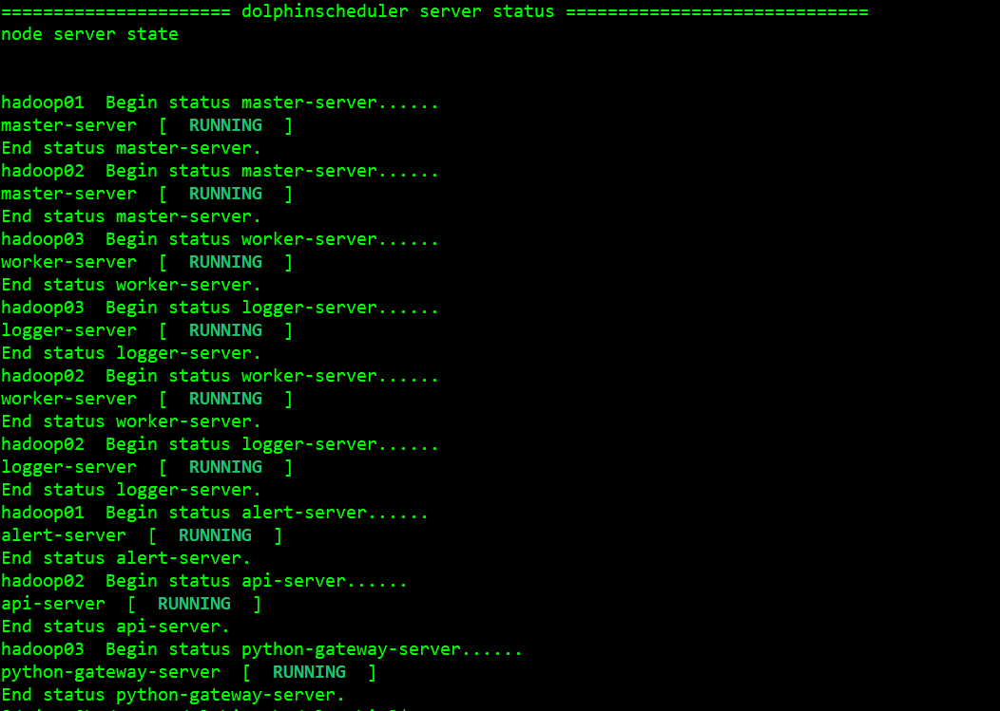

**hadoop01:**


**hadoop02:**


**hadoop03:**


==注意：有时候网络不好，无法启动另一台worker,通讯存在问题==


## Dolphinscheduler快速入门

###  管理员用户登录 

 地址：http://hadoop01:12345/dolphinscheduler 用户名密码：admin/dolphinscheduler123 

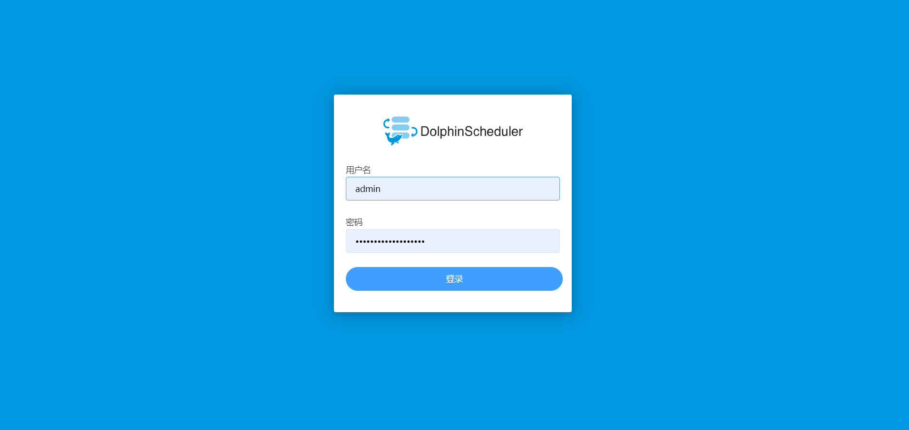

## 进入首页

可查看任务状态和流程统计状态


### 租户管理

创建操作系统租户

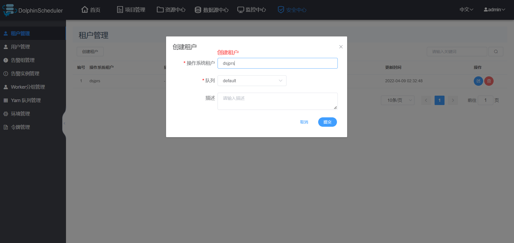

### 用户管理

创建普通登录用户

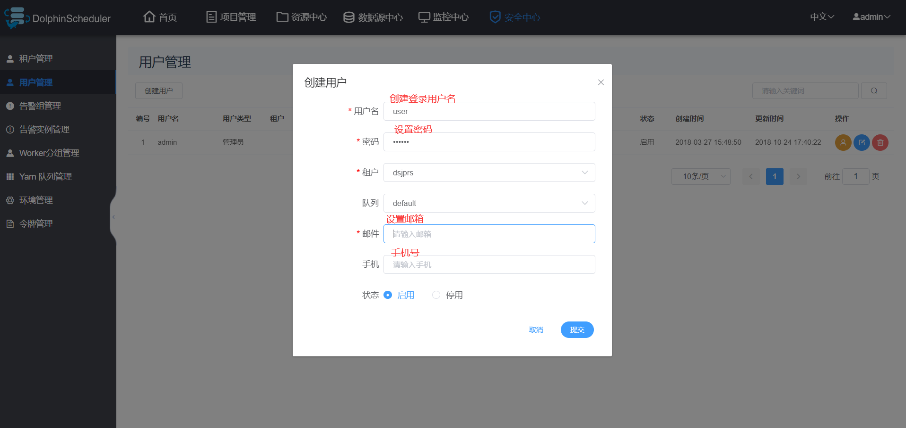

### 创建告警组

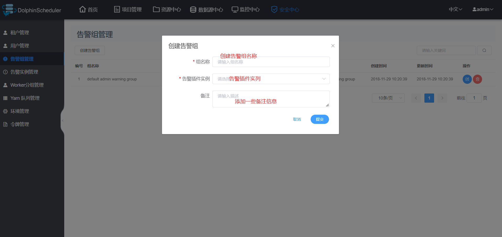

### 创建告警实列

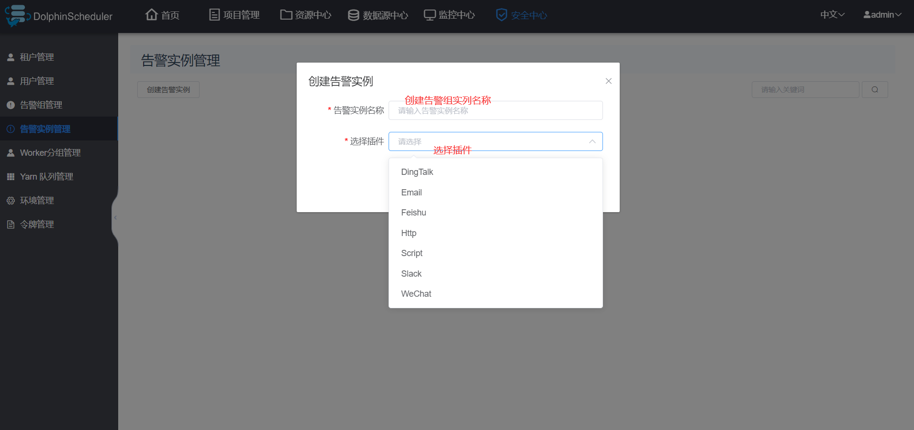

### 创建Worker分组


### 创建Yarn队列管理

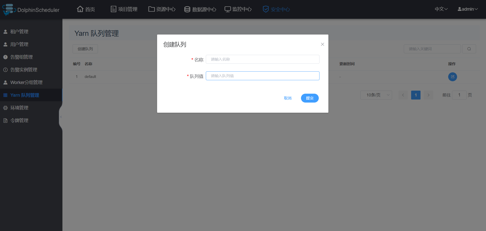

### 创建环境管理


### 创建令牌管理

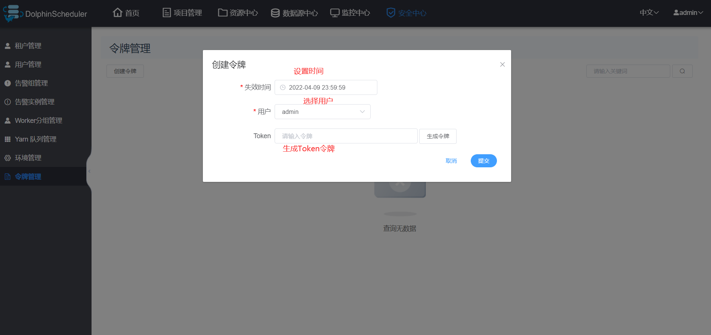

### 创建第一个项目

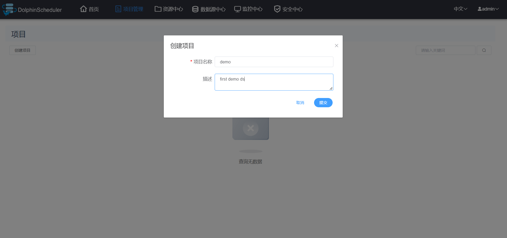


