# dolphinScheduler进阶

## 🎬功能介绍

### 📏指标总览

 *首页包含用户所有项目的任务状态统计、流程状态统计、工作流定义统计。* 

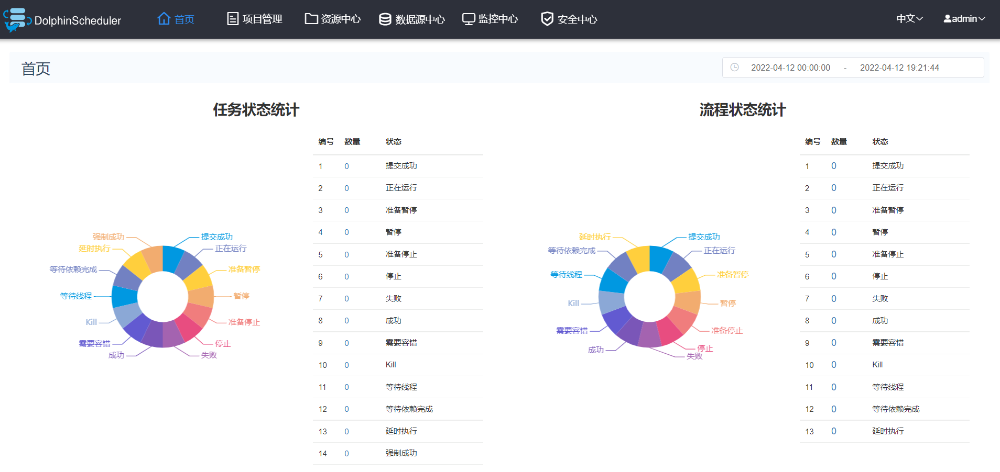

### 🔑项目管理

#### 创建项目

*点击"项目管理"进入项目管理页面，点击“创建项目”按钮，输入项目名称，项目描述，点击“提交”，创建新的项目。* 

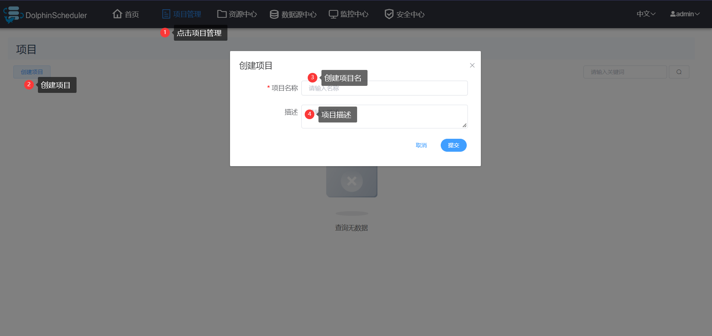

### 📠项目首页

*在项目管理页面点击项目名称链接，进入项目首页，如下图所示，项目首页包含该项目的任务状态统计、流程状态统计、工作流定义统计。这几个指标的说明如下：*

- **任务状态统计**：*在指定时间范围内，统计任务实例中状态为提交成功、正在运行、准备暂停、暂停、准备停止、停止、失败、成功、需要容错、kill、等待线程的个数。*
- **流程状态统计**：*在指定时间范围内，统计工作流实例中状态为提交成功、正在运行、准备暂停、暂停、准备停止、停止、失败、成功、需要容错、kill、等待线程的个数。*
- **工作流定义统计**：*统计用户创建的工作流定义及管理员授予该用户的工作流定义*。

 

### 📤工作流定义

#### 创建工作流定义

*点击项目管理 -> 创建项目 -> 工作流 ->工作流定义，进入工作流定义页面，点击“创建工作流”按钮，进入**工作流DAG编辑**页面，如下图所示：* 

#### 创建工作流

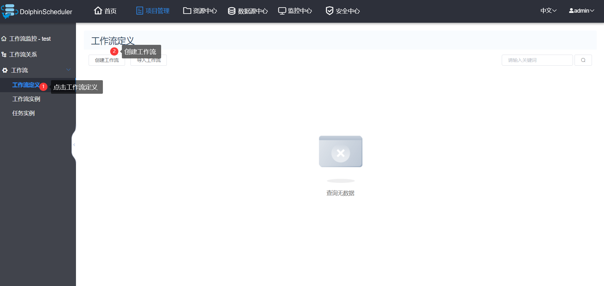

#### 进入工作流界面

 *工具栏中拖拽到画板中，新增一个Shell任务,如下图所示：* 

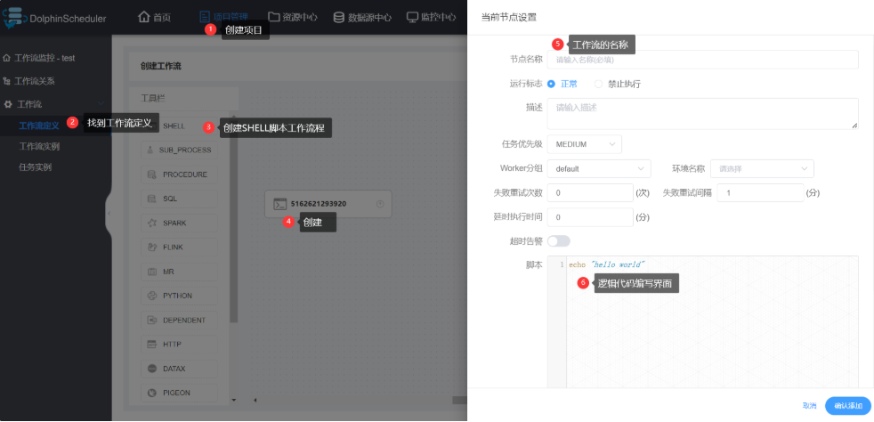

- **添加shell任务的参数设置：**
  1. 填写“节点名称”，“描述”，“脚本”字段；
  2. “运行标志”勾选“正常”，若勾选“禁止执行”，运行工作流不会执行该任务；
  3. 选择“任务优先级”：当worker线程数不足时，级别高的任务在执行队列中会优先执行，相同优先级的任务按照先进先出的顺序执行；
  4. 超时告警（非必选）：勾选超时告警、超时失败，填写“超时时长”，当任务执行时间超过**超时时长**，会发送告警邮件并且任务超时失败；
  5. 资源（非必选）。资源文件是资源中心->文件管理页面创建或上传的文件，如文件名为`test.sh`，脚本中调用资源命令为`sh test.sh`；
  6. 自定义参数（非必填）；
  7. 点击"确认添加"按钮，保存任务设置。
- **增加任务执行的先后顺序：** 点击脚本加号图标，连接任务；如下图所示，任务2和任务3并行执行，当任务1执行完，任务2、3会同时执行。

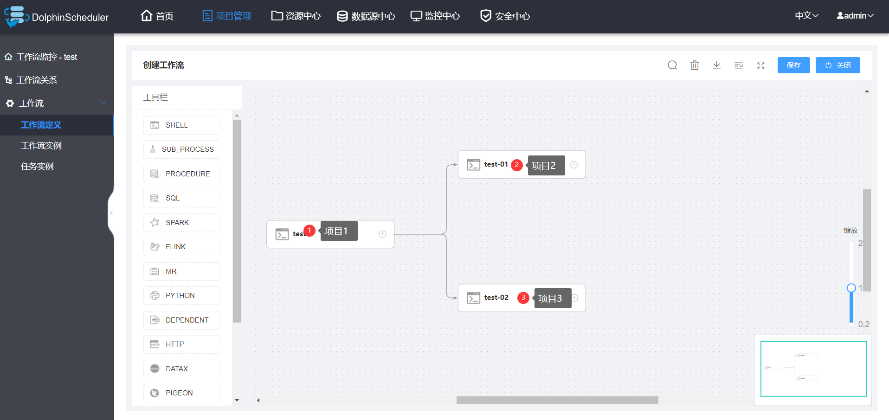

**删除依赖关系：** 选中连接线，点击右上角"箭头"图标，，点击右上角"删除"图标，删除任务间的依赖关系。 

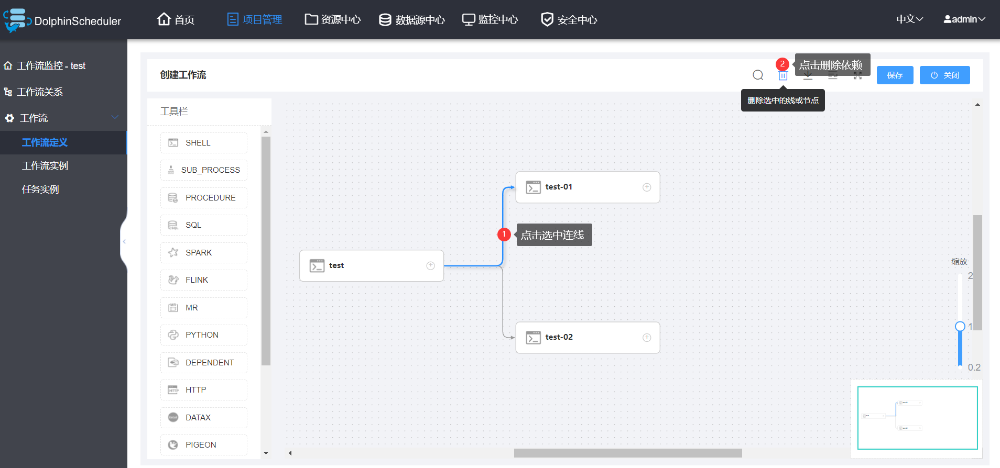**保存工作流定义：** 点击”保存“按钮，弹出"设置DAG图名称"弹框，如下图所示，输入工作流定义名称，工作流定义描述，设置全局参数（选填，参考[全局参数](https://dolphinscheduler.apache.org/zh-cn/docs/latest/user_doc/guide/parameter/global.html)），点击"添加"按钮，工作流定义创建成功。 

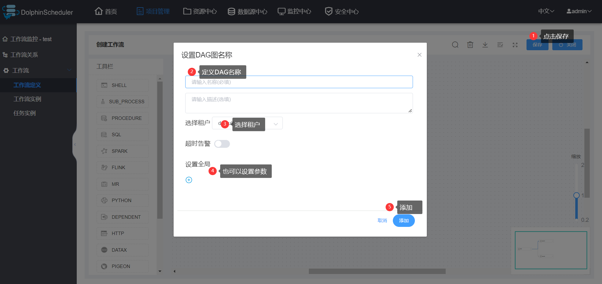

#### 工作流定义操作功能

*点击项目管理->工作流->工作流定义，进入工作流定义页面，如下图所示:* 

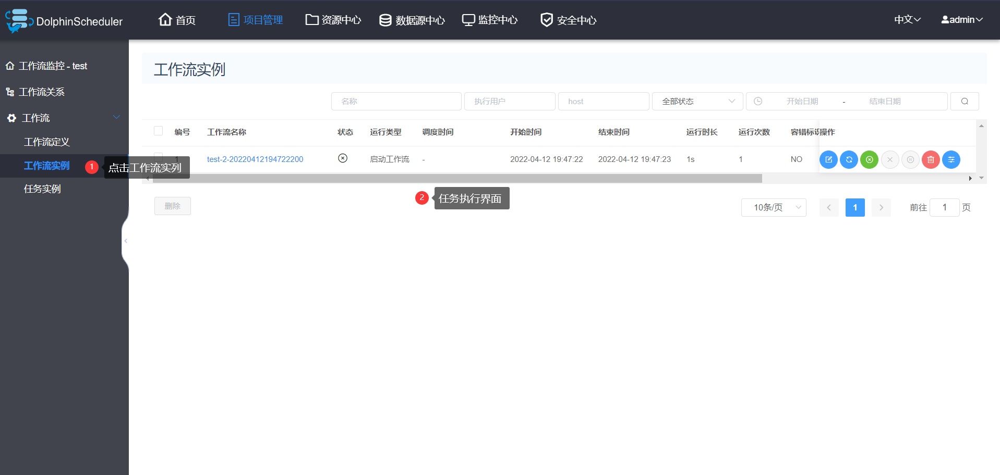

工作流定义列表的操作功能如下：

- **编辑：** 只能编辑"下线"的工作流定义。工作流DAG编辑同创建工作流定义。
- **上线：** 工作流状态为"下线"时，上线工作流，只有"上线"状态的工作流能运行，但不能编辑。
- **下线：** 工作流状态为"上线"时，下线工作流，下线状态的工作流可以编辑，但不能运行。
- **运行：** 只有上线的工作流能运行。运行操作步骤见运行工作流
- **定时：** 只有上线的工作流能设置定时，系统自动定时调度工作流运行。创建定时后的状态为"下线"，需在定时管理页面上线定时才生效。定时操作步骤见工作流定时
- **定时管理：** 定时管理页面可编辑、上线/下线、删除定时。
- **删除：** 删除工作流定义。
- **下载：** 下载工作流定义到本地。
- **树形图：** 以树形结构展示任务节点的类型及任务状态，如下图所示：

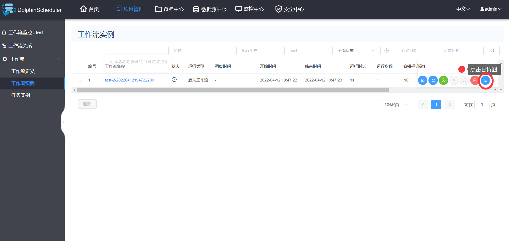

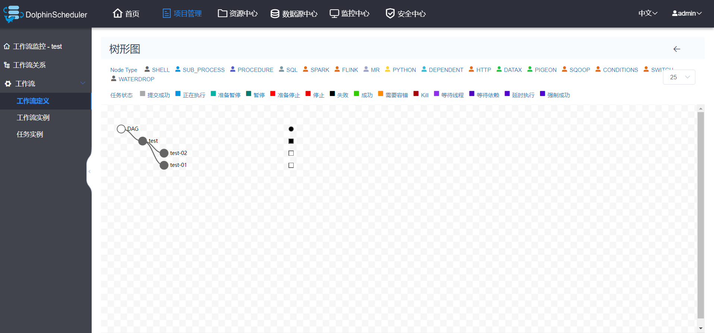

#### 运行工作流

*点击项目管理->工作流->工作流定义，进入工作流定义页面，如下图所示，点击"上线"按钮*

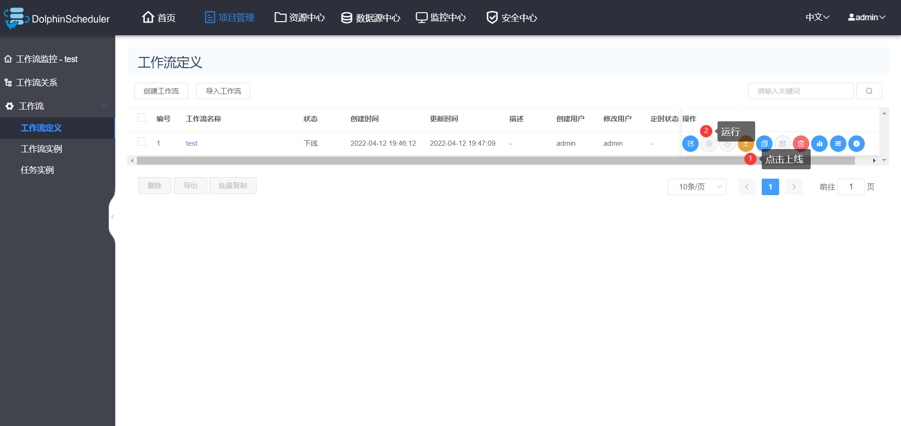 点击”运行“按钮，弹出启动参数设置弹框，如下图所示，设置启动参数，点击弹框中的"运行"按钮，工作流开始运行，工作流实例页面生成一条工作流实例。 

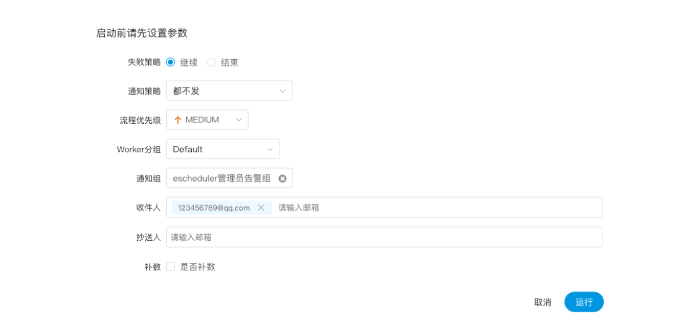

工作流运行参数说明：

- 失败策略：当某一个任务节点执行失败时，其他并行的任务节点需要执行的策略。”继续“表示：某一任务失败后，其他任务节点正常执行；”结束“表示：终止所有正在执行的任务，并终止整个流程。
- 通知策略：当流程结束，根据流程状态发送流程执行信息通知邮件，包含任何状态都不发，成功发，失败发，成功或失败都发。
- 流程优先级：流程运行的优先级，分五个等级：最高（HIGHEST），高(HIGH),中（MEDIUM）,低（LOW），最低（LOWEST）。当master线程数不足时，级别高的流程在执行队列中会优先执行，相同优先级的流程按照先进先出的顺序执行。
- worker分组：该流程只能在指定的worker机器组里执行。默认是Default，可以在任一worker上执行。
- 通知组：选择通知策略||超时报警||发生容错时，会发送流程信息或邮件到通知组里的所有成员。
- 收件人：选择通知策略||超时报警||发生容错时，会发送流程信息或告警邮件到收件人列表。
- 抄送人：选择通知策略||超时报警||发生容错时，会抄送流程信息或告警邮件到抄送人列表。
- 启动参数: 在启动新的流程实例时，设置或覆盖全局参数的值。
- 补数：包括串行补数、并行补数2种模式。串行补数：指定时间范围内，从开始日期至结束日期依次执行补数，依次生成N条流程实例；并行补数：指定时间范围内，多天同时进行补数，同时生成N条流程实例。
  - 补数： 执行指定日期的工作流定义，可以选择补数时间范围（目前只支持针对连续的天进行补数)，比如需要补5月1号到5月10号的数据，如下图所示：

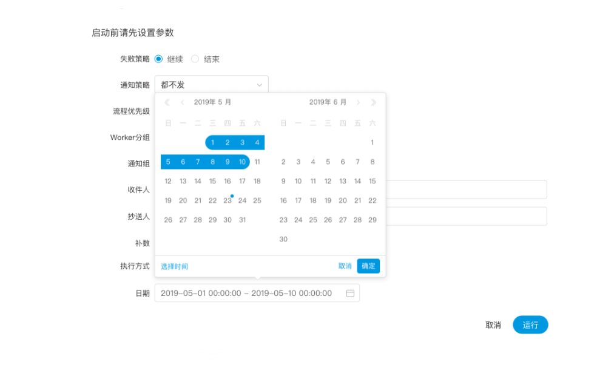

> 串行模式：补数从5月1号到5月10号依次执行，依次在流程实例页面生成十条流程实例；
>
> 并行模式：同时执行5月1号到5月10号的任务，同时在流程实例页面生成十条流程实例。

#### 工作流定时

创建定时：点击项目管理->工作流->工作流定义，进入工作流定义页面，上线工作流，点击"定时"按钮,弹出定时参数设置弹框，如下图所示： 

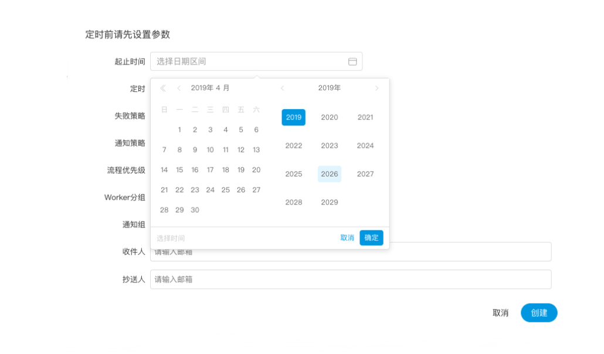

- 选择起止时间。在起止时间范围内，定时运行工作流；不在起止时间范围内，不再产生定时工作流实例。
- 添加一个每天凌晨5点执行一次的定时，如下图所示：

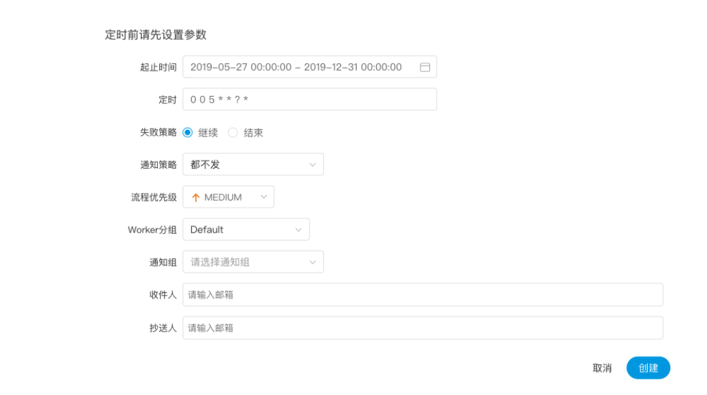

- 败策略、通知策略、流程优先级、Worker分组、通知组、收件人、抄送人同[工作流运行参数](https://dolphinscheduler.apache.org/zh-cn/docs/latest/user_doc/guide/project/workflow-definition.html#runParamers)。
- 点击"创建"按钮，创建定时成功，此时定时状态为"**下线**"，定时需**上线**才生效。
- 定时上线：点击"定时管理"按钮，进入定时管理页面，点击"上线"按钮，定时状态变为"上线"，如下图所示，工作流定时生效。

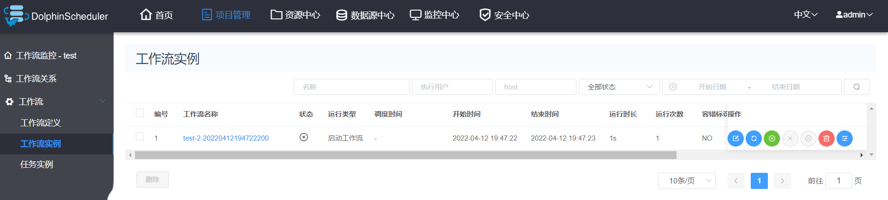

#### 导入工作流

点击项目管理->工作流->工作流定义，进入工作流定义页面，点击"导入工作流"按钮，导入本地工作流文件，工作流定义列表显示导入的工作流，状态为下线。 

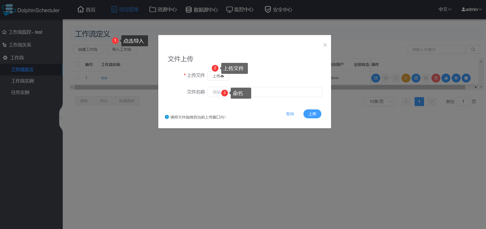

### 🔊工作流实列

#### 查看工作流实例

点击项目管理->工作流->工作流实例，进入工作流实例页面，如下图所示： 

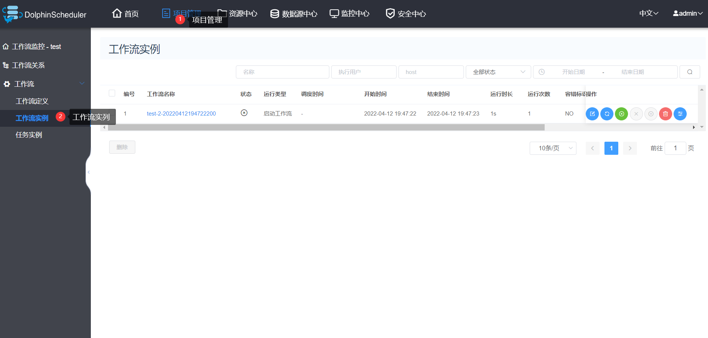

点击工作流名称，进入DAG查看页面，查看任务执行状态，如下图所示。 

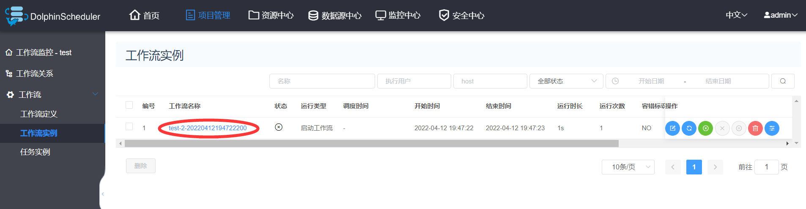

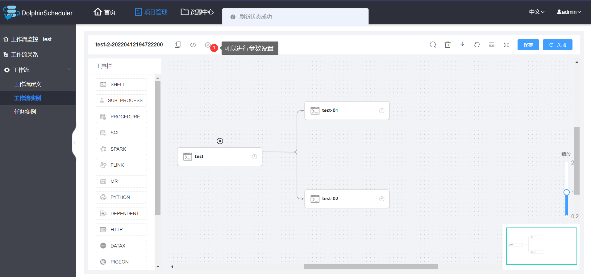

#### 查看任务日志

 点击"查看日志"，弹出日志弹框，如下图所示,任务实例页面也可查看任务日志，参考[任务查看日志](https://dolphinscheduler.apache.org/zh-cn/docs/latest/user_doc/guide/project/task-instance.html)。 

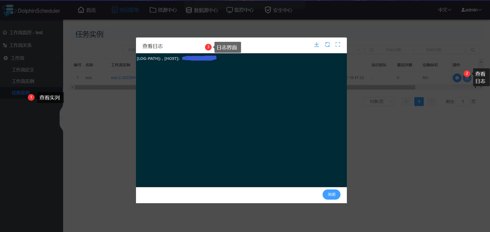

#### 查看任务历史记录

- 点击项目管理->工作流->工作流实例，进入工作流实例页面，点击工作流名称，进入工作流DAG页面;
- 双击任务节点，如下图所示，点击"查看历史"，跳转到任务实例页面，并展示该工作流实例运行的任务实例列表

#### 查看运行参数

- 点击项目管理->工作流->工作流实例，进入工作流实例页面，点击工作流名称，进入工作流DAG页面;
- 点击左上角图标，查看工作流实例的启动参数；点击图标，查看工作流实例的全局参数和局部参数，如下图所示：

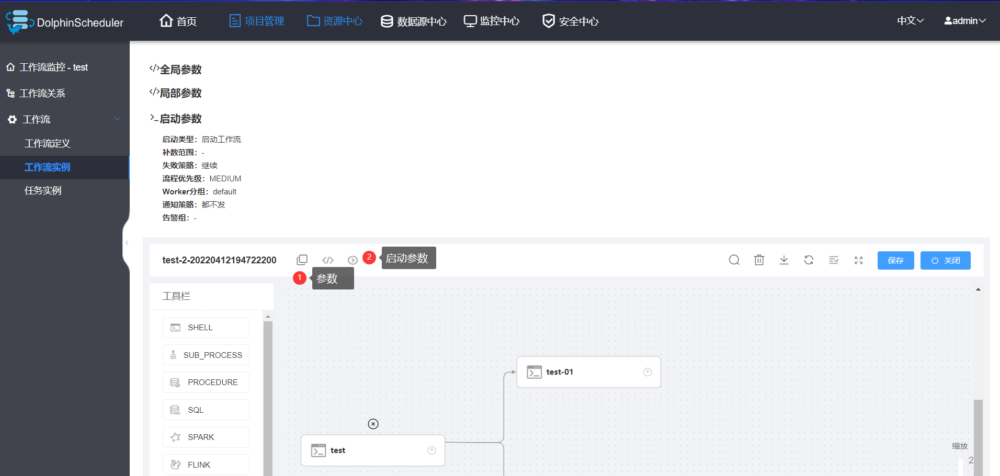

**编辑：** 只能编辑已终止的流程。点击"编辑"按钮或工作流实例名称进入DAG编辑页面，编辑后点击"保存"按钮，弹出保存DAG弹框，如下图所示，在弹框中勾选"是否更新到工作流定义"，保存后则更新工作流定义；若不勾选，则不更新工作流定义。 

- **重跑：** 重新执行已经终止的流程。
- **恢复失败：** 针对失败的流程，可以执行恢复失败操作，从失败的节点开始执行。
- **停止：** 对正在运行的流程进行**停止**操作，后台会先`kill`worker进程,再执行`kill -9`操作
- **暂停：** 对正在运行的流程进行**暂停**操作，系统状态变为**等待执行**，会等待正在执行的任务结束，暂停下一个要执行的任务。
- **恢复暂停：** 对暂停的流程恢复，直接从**暂停的节点**开始运行
- **删除：** 删除工作流实例及工作流实例下的任务实例
- **甘特图：** Gantt图纵轴是某个工作流实例下的任务实例的拓扑排序，横轴是任务实例的运行时间

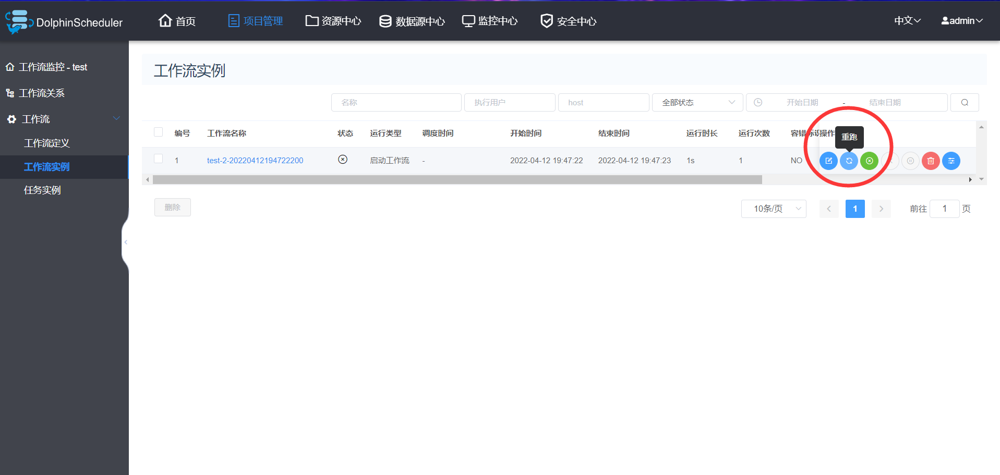

### 🔉任务实例

点击项目管理->工作流->任务实例，进入任务实例页面，如下图所示，点击工作流实例名称，可跳转到工作流实例DAG图查看任务状态。 

查看日志：点击操作列中的“查看日志”按钮，可以查看任务执行的日志情况。 

