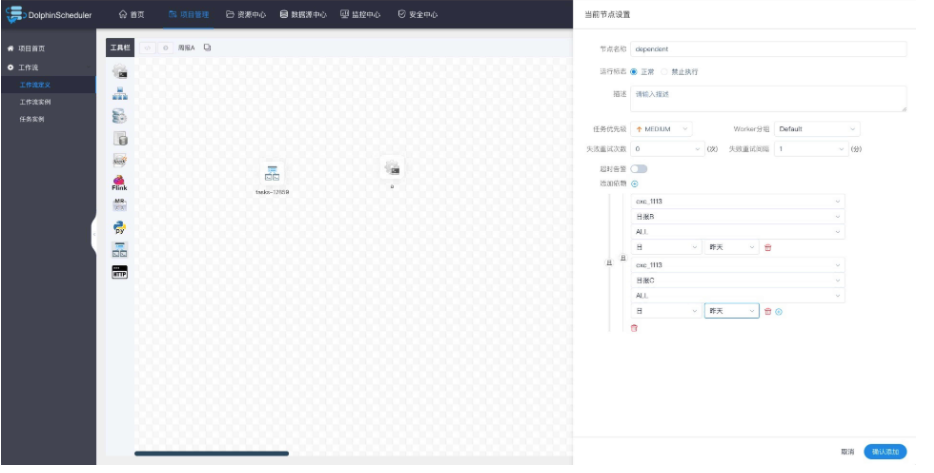

# dolphinschedluer配置进阶

## 🔐任务类型

###  🔈Shell

Shell 任务类型，用于创建 Shell 类型的任务并执行一系列的 Shell 脚本。worker 执行该任务的时候，会生成一个临时shell脚本， 并使用与租户同名的 linux 用户执行这个脚本。 

#### 创建任务

- 点击项目管理-项目名称-工作流定义，点击"创建工作流"按钮，进入DAG编辑页面。
- 工具栏中拖动到画板中，即可完成创建。

#### 任务参数

- 任务名称：设置任务的名称。一个工作流定义中的节点名称是唯一的。
- 运行标志：标识这个节点是否能正常调度,如果不需要执行，可以打开禁止执行开关。
- 描述：描述该节点的功能。
- 任务优先级：worker线程数不足时，根据优先级从高到低依次执行，优先级一样时根据先进先出原则执行。
- Worker分组：任务分配给worker组的机器机执行，选择Default，会随机选择一台worker机执行。
- 环境名称：配置运行脚本的环境。
- 失败重试次数：任务失败重新提交的次数，支持下拉和手填。
- 失败重试间隔：任务失败重新提交任务的时间间隔，支持下拉和手填。
- 超时告警：勾选超时告警、超时失败，当任务超过"超时时长"后，会发送告警邮件并且任务执行失败.
- 脚本：用户开发的SHELL程序。
- 资源：是指脚本中需要调用的资源文件列表，资源中心-文件管理上传或创建的文件。
- 自定义参数：是SHELL局部的用户自定义参数，会替换脚本中以${变量}的内容。
- 前置任务：选择当前任务的前置任务，会将被选择的前置任务设置为当前任务的上游。

#### 任务样例

该样例模拟了常见的简单任务，这些任务只需要简单的一两行命令就能运行起来。我们以打印一行日志为例，该任务仅会在日志文件中打印一行 "This is a demo of shell task" 


#### 使用自定义参数

该样例模拟了自定义参数任务，为了更方便的复用已有的任务，或者面对动态的需求时，使用变量保证脚本的复用性。本例中，先在自定义脚本 中定义了参数 "param_key"，并将他的值设置为 "param_val"。接着在"脚本"中声明了 echo 命令，将参数 "param_key" 打印了出来。当保存并运行任务后，在日志中会看到将参数 "param_key" 对应的值 "param_val" 打印出来。 


### 🔉SubProcess

- 子流程节点，就是把外部的某个工作流定义当做一个任务节点去执行。

> 拖动工具栏中，任务节点到画板中，如下图所示：


- 节点名称：一个工作流定义中的节点名称是唯一的
- 运行标志：标识这个节点是否能正常调度
- 描述信息：描述该节点的功能
- 超时告警：勾选超时告警、超时失败，当任务超过"超时时长"后，会发送告警邮件并且任务执行失败.
- 子节点：是选择子流程的工作流定义，右上角进入该子节点可以跳转到所选子流程的工作流定义

### 🔊Dependent

- 依赖节点，就是**依赖检查节点**。比如A流程依赖昨天的B流程执行成功，依赖节点会去检查B流程在昨天是否有执行成功的实例。

> 拖动工具栏中，任务节点到画板中，如下图所示：


> 依赖节点提供了逻辑判断功能，比如检查昨天的B流程是否成功，或者C流程是否执行成功。 



>  例如，A流程为周报任务，B、C流程为天任务，A任务需要B、C任务在上周的每一天都执行成功，如图示： 


### 存储过程节点

- 据选择的数据源，执行存储过程。

> 拖动工具栏中,任务节点到画板中，如下图所示：


- 数据源：存储过程的数据源类型支持MySQL和POSTGRESQL两种，选择对应的数据源
- 方法：是存储过程的方法名称
- 自定义参数：存储过程的自定义参数类型支持IN、OUT两种，数据类型支持VARCHAR、INTEGER、LONG、FLOAT、DOUBLE、DATE、TIME、TIMESTAMP、BOOLEAN九种数据类型

### SQL

 SQL任务类型，用于连接数据库并执行相应SQL。 

#### 创建任务

- 点击项目管理-项目名称-工作流定义，点击"创建工作流"按钮，进入DAG编辑页面。
- 工具栏中拖动到画板中，选择需要连接的数据源，即可完成创建。 。

### 任务参数

- 数据源：选择对应的数据源
- sql类型：支持查询和非查询两种，查询是select类型的查询，是有结果集返回的，可以指定邮件通知为表格、附件或表格附件三种模板。非查询是没有结果集返回的，是针对update、delete、insert三种类型的操作。
- sql参数：输入参数格式为key1=value1;key2=value2…
- sql语句：SQL语句
- UDF函数：对于HIVE类型的数据源，可以引用资源中心中创建的UDF函数，其他类型的数据源暂不支持UDF函数。
- 自定义参数：SQL任务类型，而存储过程是自定义参数顺序的给方法设置值自定义参数类型和数据类型同存储过程任务类型一样。区别在于SQL任务类型自定义参数会替换sql语句中${变量}。
- 前置sql:前置sql在sql语句之前执行。
- 后置sql:后置sql在sql语句之后执行。

#### 任务样例

该样例向hive中创建临时表`tmp_hello_world`并写入一行数据。选择SQL类型为非查询，在创建临时表之前需要确保该表不存在，所以我们使用自定义参数，在每次运行时获取当天时间作为表名后缀，这样这个任务就可以每天运行。创建的表名格式为：`tmp_hello_world_{yyyyMMdd}`。 


#### 运行该任务成功之后在hive中查询结果

 登录集群使用`hive`命令或使用`beeline`、`JDBC`等方式连接`apache hive`进行查询，查询SQL为`select * from tmp_hello_world_{yyyyMMdd}`，请将`{yyyyMMdd}`替换为运行当天的日期，查询截图如下： 


#### 注意事项

 注意SQL类型的选择，如果是INSERT等操作需要选择非查询类型。 

### 📢SPARK

 Spark 任务类型，用于执行 Spark 程序。对于 Spark 节点，worker 会通关使用 spark 命令 `spark submit` 方式提交任务。更多详情查看 [spark-submit](https://spark.apache.org/docs/3.2.1/submitting-applications.html#launching-applications-with-spark-submit)。 

#### 创建任务

- 点击项目管理 -> 项目名称 -> 工作流定义，点击”创建工作流”按钮，进入 DAG 编辑页面：
- 拖动工具栏，任务节点到画板中。

#### 任务参数

- 节点名称：设置任务的名称。一个工作流定义中的节点名称是唯一的。
- 运行标志：标识这个节点是否能正常调度,如果不需要执行，可以打开禁止执行开关。
- 描述：描述该节点的功能。
- 任务优先级：worker 线程数不足时，根据优先级从高到低依次执行，优先级一样时根据先进先出原则执行。
- Worker 分组：任务分配给 worker 组的机器执行，选择 Default 会随机选择一台 worker 机执行。
- 环境名称：配置运行脚本的环境。
- 失败重试次数：任务失败重新提交的次数。
- 失败重试间隔：任务失败重新提交任务的时间间隔，以分为单位。
- 延迟执行时间：任务延迟执行的时间，以分为单位。
- 超时警告：勾选超时警告、超时失败，当任务超过“超时时长”后，会发送告警邮件并且任务执行失败。
- 程序类型：支持 Java、Scala 和 Python 三种语言。
- Spark 版本：支持 Spark1 和 Spark2。
- 主函数的 Class：Spark 程序的入口 Main class 的全路径。
- 主程序包：执行 Spark 程序的 jar 包（通过资源中心上传）。
- 部署方式：支持 yarn-clusetr、yarn-client 和 local 三种模式。
- 任务名称（可选）：Spark 程序的名称。
- Driver 核心数：用于设置 Driver 内核数，可根据实际生产环境设置对应的核心数。
- Driver 内存数：用于设置 Driver 内存数，可根据实际生产环境设置对应的内存数。
- Executor 数量：用于设置 Executor 的数量，可根据实际生产环境设置对应的内存数。
- Executor 内存数：用于设置 Executor 内存数，可根据实际生产环境设置对应的内存数。
- 主程序参数：设置 Spark 程序的输入参数，支持自定义参数变量的替换。
- 选项参数：支持 `--jar`、`--files`、`--archives`、`--conf` 格式。
- 资源：如果其他参数中引用了资源文件，需要在资源中选择指定。
- 自定义参数：是 Spark 局部的用户自定义参数，会替换脚本中以 ${变量} 的内容。
- 前置任务：选择当前任务的前置任务，会将被选择的前置任务设置为当前任务的上游。

#### 任务样例

 大数据生态中常见的入门案例，常应用于 MapReduce、Flink、Spark 等计算框架。主要为统计输入的文本中，相同的单词的数量有多少。 上传主程序包在使用 Spark 任务节点时，需要利用资源中心上传执行程序的 jar 包，可参考[资源中心](https://dolphinscheduler.apache.org/zh-cn/docs/latest/user_doc/guide/resource.html)。当配置完成资源中心之后，直接使用拖拽的方式，即可上传所需目标文件。


#### 配置 Spark 节点

根据上述参数说明，配置所需的内容即可。


#### 注意事项

 注意：JAVA 和 Scala 只是用来标识，没有区别，如果是 Python 开发的 Spark 则没有主函数的 class，其他都是一样。 

### 📣MapReduce(MR) 

MapReduce(MR) 任务类型，用于执行 MapReduce 程序。对于 MapReduce 节点，worker 会通过使用 Hadoop 命令 `hadoop jar` 的方式提交任务。 

#### 创建任务

- 点击项目管理-项目名称-工作流定义，点击"创建工作流"按钮，进入 DAG 编辑页面。
- 拖动工具栏中，任务节点到画板中，如下图所示：

#### 任务参数

- 节点名称：设置任务的名称。一个工作流定义中的节点名称是唯一的。
- 运行标志：标识这个节点是否能正常调度,如果不需要执行，可以打开禁止执行开关。
- 描述：描述该节点的功能。
- 任务优先级：worker 线程数不足时，根据优先级从高到低依次执行，优先级一样时根据先进先出原则执行。
- Worker 分组：任务分配给 worker 组的机器执行，选择Default，会随机选择一台 worker 机执行。
- 环境名称：配置运行脚本的环境。
- 失败重试次数：任务失败重新提交的次数。
- 失败重试间隔：任务失败重新提交任务的时间间隔，以分为单位。
- 延迟执行时间：任务延迟执行的时间，以分为单位。
- 超时告警：勾选超时告警、超时失败，当任务超过"超时时长"后，会发送告警邮件并且任务执行失败。
- 资源：是指脚本中需要调用的资源文件列表，资源中心-文件管理上传或创建的文件。
- 自定义参数：是 MapReduce 局部的用户自定义参数，会替换脚本中以 ${变量} 的内容。
- 前置任务：选择当前任务的前置任务，会将被选择的前置任务设置为当前任务的上游。

#### JAVA/SCALA 程序

- 程序类型：选择 JAVA/SCALA 语言。
- 主函数的 Class：是 MapReduce 程序的入口 Main Class 的**全路径**。
- 主程序包：执行 MapReduce 程序的 jar 包。
- 任务名称（选填）：MapReduce 任务名称。
- 命令行参数：是设置 MapReduce 程序的输入参数，支持自定义参数变量的替换。
- 其他参数：支持 –D、-files、-libjars、-archives 格式。
- 资源： 如果其他参数中引用了资源文件，需要在资源中选择指定
- 自定义参数：是 MapReduce 局部的用户自定义参数，会替换脚本中以 ${变量} 的内容

#### Python 程序

- 程序类型：选择 Python 语言。
- 主 jar 包：是运行 MapReduce 的 Python jar 包。
- 其他参数：支持 –D、-mapper、-reducer、-input -output格式，这里可以设置用户自定义参数的输入，比如：
- -mapper "[mapper.py](http://mapper.py/) 1" -file [mapper.py](http://mapper.py/) -reducer [reducer.py](http://reducer.py/) -file [reducer.py](http://reducer.py/) –input /journey/words.txt -output /journey/out/mr/${currentTimeMillis}
- 其中 -mapper 后的 [mapper.py](http://mapper.py/) 1是两个参数，第一个参数是 [mapper.py](http://mapper.py/)，第二个参数是 1。
- 资源： 如果其他参数中引用了资源文件，需要在资源中选择指定。
- 自定义参数：是 MapReduce 局部的用户自定义参数，会替换脚本中以 ${变量} 的内容。

#### 任务样例

执行 WordCount 程序该样例为 MapReduce 应用中常见的入门类型，主要为统计输入的文本中，相同单词的数量有多少。上传主程序包在使用 MapReduce 任务节点时，需要利用资源中心上传执行程序的 jar 包。可参考[资源中心](https://dolphinscheduler.apache.org/zh-cn/docs/latest/user_doc/guide/resource.html)。当配置完成资源中心之后，直接使用拖拽的方式，即可上传所需目标文件。


#### 配置 MapReduce 节点

根据上述参数说明，配置所需的内容即可。


### 🔔Python

用于`Python Task`创建 python 类型的任务并执行 python 脚本。worker执行`Python Task`时会生成一个临时的python脚本，由与租户同名的Linux用户执行该脚本。 

#### 创建任务

- 点击项目管理-项目名称-工作流定义，点击“创建工作流”按钮，进入DAG编辑页面。
- 从工具栏拖到画布上。

#### 任务参数

- 节点名称：工作流定义中的节点名称是唯一的。
- 运行标志：标识该节点是否可以正常调度，如果不需要执行，可以打开禁止开关。
- 描述性信息：描述节点的功能。
- 任务优先级：当工作线程数不足时，按照优先级从高到低的顺序执行，相同优先级的任务会按照先进先出的顺序执行。
- 工人分组：将任务分配给工人组的机器来执行。如果`Default`选中，则随机选择一台worker机器执行。
- 环境名称：配置运行脚本的环境名称。
- 重试失败次数：失败任务重提交的次数。它支持下拉和手动填充。
- 失败重试间隔：任务失败后重新提交任务的时间间隔。它支持下拉和手动填充。
- 超时告警：查看超时告警和超时故障。当任务超过“超时时间”时，会发送告警邮件，任务执行失败。
- 脚本：用户开发的Python程序。
- 资源：指脚本中需要调用的资源文件列表，以及资源中心-文件管理上传或创建的文件。
- 自定义参数：是Python的用户自定义参数，将脚本中的内容替换为${variable}。

#### 任务示例

此示例模拟一个通过简单命令运行的常见任务。示例是在日志文件中打印一行，如下图：“This is a demo of python task”。 


```python
print("This is a demo of python task")
```

#### 自定义参数

本示例模拟自定义参数任务。使用参数来重用现有任务作为模板或应对动态任务。在这种情况下，声明了一个名为“param_key”的自定义参数，其值为“param_val”。然后使用 echo 打印我们刚刚声明的参数“${param_key}”。运行此示例后，将在日志中看到“param_val”打印。


```python
print("${param_key}")
```

### 🎼Flink

 Flink 任务类型，用于执行 Flink 程序。对于 Flink 节点，worker 会通过使用 flink 命令 `flink run` 的方式提交任务。 

#### 创建任务

- 点击项目管理-项目名称-工作流定义，点击“创建工作流”按钮，进入 DAG 编辑页面；
- 拖动工具栏，任务节点到画板中。

#### 任务参数

- 节点名称：设置任务的名称。一个工作流定义中的节点名称是唯一的。
- 运行标志：标识这个节点是否能正常调度,如果不需要执行，可以打开禁止执行开关。
- 描述：描述该节点的功能。
- 任务优先级：worker 线程数不足时，根据优先级从高到低依次执行，优先级一样时根据先进先出原则执行。
- Worker 分组：任务分配给 worker 组的机器执行，选择 Default，会随机选择一台 worker 机执行。
- 环境名称：配置运行脚本的环境。
- 失败重试次数：任务失败重新提交的次数。
- 失败重试间隔：任务失败重新提交任务的时间间隔，以分为单位。
- 延迟执行时间：任务延迟执行的时间，以分为单位。
- 超时告警：勾选超时告警、超时失败，当任务超过"超时时长"后，会发送告警邮件并且任务执行失败。
- 程序类型：支持 Java、Scala 和 Python 三种语言。
- 主函数的 Class：Flink 程序的入口 Main Class 的**全路径**。
- 主程序包：执行 Flink 程序的 jar 包（通过资源中心上传）。
- 部署方式：支持 cluster 和 local 两种模式的部署。
- Flink 版本：根据所需环境选择对应的版本即可。
- 任务名称（选填）：Flink 程序的名称。
- jobManager 内存数：用于设置 jobManager 内存数，可根据实际生产环境设置对应的内存数。
- Slot 数量：用于设置 Slot 的数量，可根据实际生产环境设置对应的数量。
- taskManager 内存数：用于设置 taskManager 内存数，可根据实际生产环境设置对应的内存数。
- taskManager 数量：用于设置 taskManager 的数量，可根据实际生产环境设置对应的数量。
- 并行度：用于设置执行 Flink 任务的并行度。
- 主程序参数：设置 Flink 程序的输入参数，支持自定义参数变量的替换。
- 选项参数：支持 `--jar`、`--files`、`--archives`、`--conf` 格式。
- 资源：如果其他参数中引用了资源文件，需要在资源中选择指定。
- 自定义参数：是 Flink 局部的用户自定义参数，会替换脚本中以 ${变量} 的内容
- 前置任务：选择当前任务的前置任务，会将被选择的前置任务设置为当前任务的上游。

#### 任务样例

执行 WordCount 程序本案例为大数据生态中常见的入门案例，常应用于 MapReduce、Flink、Spark 等计算框架。主要为统计输入的文本中，相同的单词的数量有多少。（Flink 的 Releases 附带了此示例作业），上传主程序包在使用 Flink 任务节点时，需要利用资源中心上传执行程序的 jar 包，可参考[资源中心](https://dolphinscheduler.apache.org/zh-cn/docs/latest/user_doc/guide/resource.html)。当配置完成资源中心之后，直接使用拖拽的方式，即可上传所需目标文件。


#### 配置 Flink 节点

 根据上述参数说明，配置所需的内容即可。 


#### 注意事项

Java 和 Scala 只是用来标识，没有区别，如果是 Python 开发的 Flink 则没有主函数的 class，其余的都一样。 

### 🎵http

- 拖动工具栏中，任务节点到画板中，如下图所示：


- 节点名称：一个工作流定义中的节点名称是唯一的。
- 运行标志：标识这个节点是否能正常调度,如果不需要执行，可以打开禁止执行开关。
- 描述信息：描述该节点的功能。
- 任务优先级：worker线程数不足时，根据优先级从高到低依次执行，优先级一样时根据先进先出原则执行。
- Worker分组：任务分配给worker组的机器机执行，选择Default，会随机选择一台worker机执行。
- 失败重试次数：任务失败重新提交的次数，支持下拉和手填。
- 失败重试间隔：任务失败重新提交任务的时间间隔，支持下拉和手填。
- 超时告警：勾选超时告警、超时失败，当任务超过"超时时长"后，会发送告警邮件并且任务执行失败.
- 请求地址：http请求URL。
- 请求类型：支持GET、POSt、HEAD、PUT、DELETE。
- 请求参数：支持Parameter、Body、Headers。
- 校验条件：支持默认响应码、自定义响应码、内容包含、内容不包含。
- 校验内容：当校验条件选择自定义响应码、内容包含、内容不包含时，需填写校验内容。
- 自定义参数：是http局部的用户自定义参数，会替换脚本中以${变量}的内容。


### 🎶Datax

 拖动工具栏中，任务节点到画板中 


- 自定义模板：打开自定义模板开关时，可以自定义datax节点的json配置文件内容（适用于控件配置不满足需求时）
- 数据源：选择抽取数据的数据源
- sql语句：目标库抽取数据的sql语句，节点执行时自动解析sql查询列名，映射为目标表同步列名，源表和目标表列名不一致时，可以通过列别名（as）转换
- 目标库：选择数据同步的目标库
- 目标表：数据同步的目标表名
- 前置sql:前置sql在sql语句之前执行（目标库执行）。
- 后置sql:后置sql在sql语句之后执行（目标库执行）。
- json：datax同步的json配置文件
- 自定义参数：SQL任务类型，而存储过程是自定义参数顺序的给方法设置值自定义参数类型和数据类型同存储过程任务类型一样。区别在于SQL任务类型自定义参数会替换sql语句中${变量}。

### 🎙Pigeon

Pigeon任务类型与通过调用远程websocket服务，实现远程任务的触发，状态、日志的获取，是 DolphinScheduler 通用远程 websocket 服务调用任务 

#### 创建任务

 拖动工具栏中，任务节点到画板中即能完成任务创建 

#### 任务参数

- 节点名称：一个工作流定义中的节点名称是唯一的。
- 运行标志：标识这个节点是否能正常调度,如果不需要执行，可以打开禁止执行开关。
- 描述信息：描述该节点的功能。
- 任务优先级：worker线程数不足时，根据优先级从高到低依次执行，优先级一样时根据先进先出原则执行。
- Worker分组：任务分配给worker组的机器机执行，选择Default，会随机选择一台worker机执行。
- 失败重试次数：任务失败重新提交的次数，支持下拉和手填。
- 失败重试间隔：任务失败重新提交任务的时间间隔，支持下拉和手填。
- 超时告警：勾选超时告警、超时失败，当任务超过"超时时长"后，会发送告警邮件并且任务执行失败.
- 目标任务名：输入Pigeon任务的目标任务名称

### 🎤Conditions

 Conditions是一个条件节点，根据上游任务运行状态，判断应该运行哪个下游任务。截止目前Conditions支持多个上游任务，但只支持两个下游任务。当上游任务数超过一个时，可以通过`且`以及`或`操作符实现复杂上游依赖 

#### 创建任务

 拖动工具栏中，任务节点到画板中即能完成任务创建，如下图所示： 


#### 任务参数

- 节点名称：一个工作流定义中的节点名称是唯一的。
- 运行标志：标识这个节点是否能正常调度,如果不需要执行，可以打开禁止执行开关。
- 描述信息：描述该节点的功能。
- 任务优先级：worker线程数不足时，根据优先级从高到低依次执行，优先级一样时根据先进先出原则执行。
- Worker分组：任务分配给worker组的机器机执行，选择Default，会随机选择一台worker机执行。
- 失败重试次数：任务失败重新提交的次数，支持下拉和手填。
- 失败重试间隔：任务失败重新提交任务的时间间隔，支持下拉和手填。
- 超时告警：勾选超时告警、超时失败，当任务超过"超时时长"后，会发送告警邮件并且任务执行失败.
- 下游任务选择：目前支持两个分支，成功、失败
  - 成功：当上游运行成功时，运行成功选择的分支
  - 失败：当上游运行失败时，运行失败选择的分支
- 上游条件选择：可以为conditions选择一个或多个上游任务
  - 增加上游依赖：通过选择第一个参数选择对应的任务名称，通过第二个参数选择触发的conditions任务的状态
  - 上游任务关系选择：当有多个上游任务时，可以通过`且`以及`或`操作符实现任务的复杂关系。


#### 相关任务

[switch](https://dolphinscheduler.apache.org/zh-cn/docs/latest/user_doc/guide/task/switch.html)：Condition节点主要依据上游节点的执行状态（成功、失败）执行对应分支。[Switch](https://dolphinscheduler.apache.org/zh-cn/docs/latest/user_doc/guide/task/switch.html)节点主要依据全局变量的值和用户所编写的表达式判断结果执行对应分支 

### 🎛Switch

 Switch是一个条件判断节点，依据[全局变量](https://dolphinscheduler.apache.org/zh-cn/docs/latest/user_doc/guide/parameter/global.html)的值和用户所编写的表达式判断结果执行对应分支。 

#### 创建任务

拖动工具栏中，任务节点到画板中即能完成任务创建，**注意**switch任务创建后，要先配置上下游，才能配置任务分支的参数 

#### 任务参数

- 节点名称：一个工作流定义中的节点名称是唯一的。
- 运行标志：标识这个节点是否能正常调度,如果不需要执行，可以打开禁止执行开关。
- 描述信息：描述该节点的功能。
- 任务优先级：worker线程数不足时，根据优先级从高到低依次执行，优先级一样时根据先进先出原则执行。
- Worker分组：任务分配给worker组的机器机执行，选择Default，会随机选择一台worker机执行。
- 失败重试次数：任务失败重新提交的次数，支持下拉和手填。
- 失败重试间隔：任务失败重新提交任务的时间间隔，支持下拉和手填。
- 超时告警：勾选超时告警、超时失败，当任务超过"超时时长"后，会发送告警邮件并且任务执行失败.
- 条件：可以为switch任务配置多个条件，当条件满足时，就会执行指定的分支，可以配置多个不同的条件来满足不同的业务
- 分支流转：默认的流转内容，当**条件**中的内容为全部不符合要求时，则运行**分支流转**中指定的分支

#### 详细流程

假设存在三个任务，其依赖关系是 `A -> B -> [C, D]` 其中task_a是shell任务，task_b是switch任务

- 任务A中通过[全局变量](https://dolphinscheduler.apache.org/zh-cn/docs/latest/user_doc/guide/parameter/global.html)定义了名为`id`的全局变量，声明方式为`${setValue(id=1)}`
- 任务B增加条件，使用上游声明的全局变量实现条件判断（注意switch运行时存在的全局变量就行，意味着可以是非直接上游产生的全局变量）。下面我们想要实现当id为1时，运行任务C，其他运行任务D
  - 配置当全局变量`id=1`时，运行任务C。则在任务B的条件中编辑`${id} == 1`，分支流转选择`C`
  - 对于其他任务，在分支流转中选择`D`

最终switch任务的配置如下


#### 相关任务

[condition](https://dolphinscheduler.apache.org/zh-cn/docs/latest/user_doc/guide/task/conditions.html)：[Condition](https://dolphinscheduler.apache.org/zh-cn/docs/latest/user_doc/guide/task/conditions.html)节点主要依据上游节点的执行状态（成功、失败）执行对应分支。Switch节点主要依据全局变量的值和用户所编写的表达式判断结果执行对应分支 