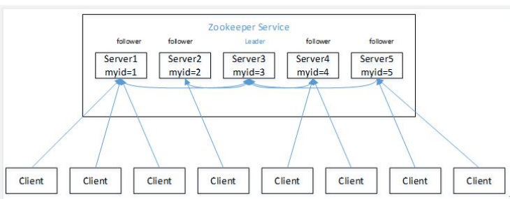
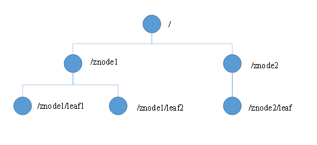
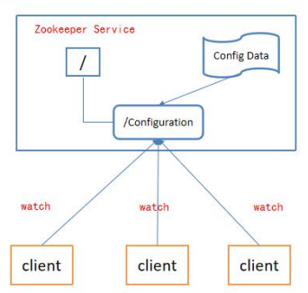
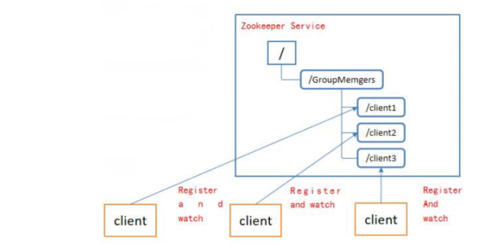
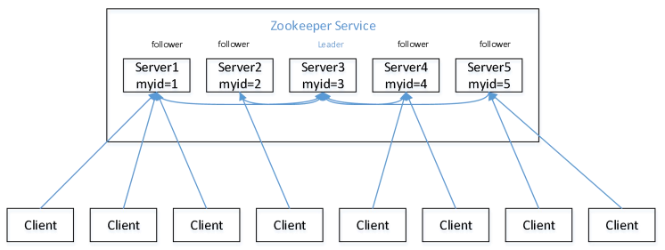
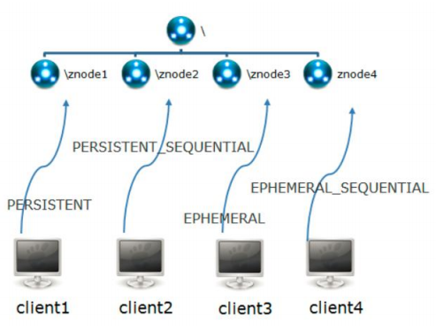

# **Zookeeper 概述**

## **概述** 

Zookeeper 是一个开源的分布式的，为分布式应用提供协调服务的 Apache 项目。


##  **Zookeeper 工作机制**

Zookeeper 从设计模式角度来理解：是一个基于观察者模式设计的分布式服务管理框架，它 负责存储和管理大家都关心的数据，然后接受观察者的注册，一旦这些数据的状态发生变化， Zookeeper 就将负责通知已经在 Zookeeper 上注册的那些观察者做出相应的反应，从而实现集群中类似 Master/Slave 管理模式


1 服务端启动时去注册信息（创建都是临时节点） 

2 获取到当前在线服务器列表，并且注册监听 

3 服务器节点下线 

4 服务器节点上下线事件通知 

5 process(){ 

重新再去获取服务器列表，并注册监听 

}

## **Zookeeper 特点**

1）Zookeeper：一个领导者（leader），多个跟随者（follower）组成的集群。 

2）Leader 负责进行投票的发起和决议，更新系统状态 

3）Follower 用于接收客户请求并向客户端返回结果，在选举 Leader 过程中参与投票 

4）集群中只要有半数以上节点存活，Zookeeper 集群就能正常服务。 

5）全局数据一致：每个 server 保存一份相同的数据副本，client 无论连接到哪个 server，数据都是一致的。 

6）更新请求顺序进行，来自同一个 client 的更新请求按其发送顺序依次执行。 

7）数据更新原子性，一次数据更新要么成功，要么失败。 

8）实时性，在一定时间范围内，client 能读到最新数据。




## **Zookeeper 数据结构**

ZooKeeper 数据模型的结构与 Unix 文件系统很类似，整体上可以看作是一棵树，每个节点称 做一个 ZNode。每一个 ZNode 默认能够存储 1MB 的数据，每个 ZNode 都可以通过其路径唯 一标识。




## **应用场景**

提供的服务包括：统一命名服务、统一配置管理、统一集群管理、服务器节点动态上下线、软负载均衡等。 

* 统一的命名服务：在分布式环境下，经常需要对应用/服务进行统一命名，便于识别不同服务。

  （1）类似于域名与 ip 之间对应关系，ip 不容易记住，而域名容易记住。 
  
  （2）通过名称来获取资源或服务的地址，提供者等信息。 


* 统一的配置管理：

1）分布式环境下，配置文件管理和同步是一个常见问题。 

（1）一个集群中，所有节点的配置信息是一致的，比如 Hadoop 集群。 

（2）对配置文件修改后，希望能够快速同步到各个节点上。 

2）配置管理可交由 ZooKeeper 实现。 

（1）可将配置信息写入 ZooKeeper 上的一个 Znode。 

（2）各个节点监听这个 Znode。 

（3）一旦 Znode 中的数据被修改，ZooKeeper 将通知各个节点。



* 统一集群管理：

1）分布式环境中，实时掌握每个节点的状态是必要的。 

（1）可根据节点实时状态做出一些调整。 

2）可交由 ZooKeeper 实现。 

（1）可将节点信息写入 ZooKeeper 上的一个 Znode。 

（2）监听这个 Znode 可获取它的实时状态变化。 

3）典型应用 

（1）HBase 中 Master 状态监控与选举。



* 服务器动态上下线


* 较负载均衡


**Zookeeper 本地模式安装**

本地模式安装 

1）安装前准备： 

（1）安装 jdk 

（2）通过 SecureCRT 工具拷贝 zookeeper 到 linux 系统下 

（3）修改 tar 包所有者 

```sh
chmod u+x zookeeper-3.4.10.tar.gz 
```

（4）解压到指定目录 

​	

```sh
[dsjprs@hadoop102 software]$ tar -zxvf zookeeper-3.4.10.tar.gz -C /opt/module/ 
```

2）配置修改 

​		将/opt/module/zookeeper-3.4.10/conf 这个路径下的 zoo_sample.cfg 修改为 zoo.cfg； 

​		进入 zoo.cfg 文件：vim zoo.cfg 

​		修改 dataDir 路径为 

​		

```sh
dataDir=/opt/module/zookeeper-3.4.10/zkData 

# 在/opt/module/zookeeper-3.4.10/这个目录上创建 zkData 文件夹 

mkdir zkData
```


### 配置参数解读 

解读 zoo.cfg 文件中参数含义 

1）tickTime=2000：通信心跳数 

2）tickTime：通信心跳数，Zookeeper 服务器心跳时间，单位毫秒 Zookeeper 使用的基本时间，服务器之间	  或客户端与服务器之间维持心跳的时间间隔，也就是每个 tickTime 时间就会发送一个心跳，时间单位为	  毫秒。 它用于心跳机制，并且设置最小的 session 超时时间为两倍心跳时间。(session 的最小超时时间是 	  2*tickTime)。 

3）initLimit=10：LF 初始通信时限 

4）initLimit：LF 初始通信时限集群中的follower跟随者服务器(F)与leader领导者服务器(L)之间初始连接时能	  容忍的最多心跳数（tickTime 的数量），用它来限定集群中的 Zookeeper 服务器连接到 Leader 的时限。 	  投票选举新 leader 的初始化时间。Follower 在启动过程中，会从 Leader 同步所有最新数据，然后确定自	  己能够对外服务的起始状态。 Leader 允许 F 在 initLimit 时间内完成这个工作。 

5）syncLimit=5：LF 同步通信时限 

6）syncLimit：LF 同步通信时限集群中 Leader 与 Follower 之间的最大响应时间单位，假如响应超过 			  	  syncLimit * tickTime，Leader 认为 Follwer 死掉，从服务器列表中删除 Follwer。 在运行过程中，Leader 	  负责与 ZK 集群中所有机器进行通信，例如通过一些心跳检测机制，来检测机器的存活状态。如果 L 发	  出心跳包在 syncLimit 之后，还没有从 F 那收到响应，那么就认为这个F 已经不在线了。 

7）dataDir：数据文件目录+数据持久化路径 

​	 保存内存数据库快照信息的位置，如果没有其他说明，更新的事务日志也保存到数据库。 

8）clientPort=2181：客户端连接服务器端口


## **Zookeeper 内部原理**

**选举机制**

1）半数机制：集群中半数以上机器存活，集群可用。所以 zookeeper 适合装在奇数台机器上。

2）Zookeeper 虽然在配置文件中并没有指定 master 和 slave。但是，zookeeper工作时，是有一个节点为 	 	 	  leader，其他则为 follower，Leader 是通过内部的选举机制临时产生的。 

3）以一个简单的例子来说明整个选举的过程。 

​	 假设有五台服务器组成的 zookeeper 集群，它们的 id 从 1-5，同时它们都是最新启动的，也就是没有

​	历史数据，在存放数据量这一点上，都是一样的。假设这些服务器依序启动，来看看会发生什么。



（1）服务器 1 启动，此时只有它一台服务器启动了，它发出去的信息没有任何响应， 所以它的选举状态一直是 LOOKING 状态。 

（2）服务器 2 启动，它与最开始启动的服务器 1 进行通信，互相交换自己的选举结果，

​		由于两者都没有历史数据，所以 id 值较大的服务器 2 胜出，但是由于没有达到超过

​		半数以上的服务器都同意选举它(这个例子中的半数以上是 3)，所以服务器 1、2 

​		还是继续保持LOOKING 状态。 

（3）服务器 3 启动，根据前面的理论分析，服务器 3 成为服务器 1、2、3 中的老大， 

​		而与上面不同的是，此时有三台服务器选举了它，所以它成为了这次选举的 leader。 

（4）服务器 4 启动，根据前面的分析，理论上服务器 4 应该是服务器 1、2、3、4 中

​		最大的，但是由于前面已经有半数以上的服务器选举了服务器 3，所以它只能接收当

​		小弟的命了。

（5）服务器 5 启动，同 4 一样当小弟。

## **节点类型 **

1）Znode 有两种类型： 

​	 短暂（ephemeral）：客户端和服务器端断开连接后，创建的节点自动删除 

​	 持久（persistent）：客户端和服务器端断开连接后，创建的节点不删除 

2）Znode 有四种形式的目录节点（默认是 persistent ） 

（1）持久化目录节点（PERSISTENT） 

​		客户端与 zookeeper 断开连接后，该节点依旧存在 

（2）持久化顺序编号目录节点（PERSISTENT_SEQUENTIAL） 

​		 客户端与 zookeeper 断开连接后，该节点依旧存在，只是 Zookeeper 给

​		 该节点名称进行顺序编号 

（3）临时目录节点（EPHEMERAL） 

​		 客户端与 zookeeper 断开连接后，该节点被删除 

（4）临时顺序编号目录节点（EPHEMERAL_SEQUENTIAL） 

​		客户端与 zookeeper 断开连接后，该节点被删除，只是 Zookeeper 给该节点

​		名称进行顺序编号



3）创建 znode 时设置顺序标识，znode 名称后会附加一个值，顺序号是一个单调递增

​	 的计数器，由父节点维护 

4）在分布式系统中，顺序号可以被用于为所有的事件进行全局排序，这样客户端可以

​	 通过顺序号推断事件的顺序 


3.3 stat 结构体: 

1）czxid- 引起这个 znode 创建的 zxid，创建节点的事务的 zxid 

​	 每次修改 ZooKeeper 状态都会收到一个 zxid 形式的时间戳，也就是 ZooKeeper 事务 ID。 

​	 事务 ID 是 ZooKeeper 中所有修改总的次序。每个修改都有唯一的 zxid，如果 zxid1 小于 	

​	 zxid2，那么 zxid1 在 zxid2 之前发生。 

2）ctime - znode 被创建的毫秒数(从 1970 年开始) 

3）mzxid - znode 最后更新的 zxid 

4）mtime - znode 最后修改的毫秒数(从 1970 年开始) 

5）pZxid-znode 最后更新的子节点 zxid 

6）cversion - znode 子节点变化号，znode 子节点修改次数 

7）dataversion - znode 数据变化号 

8）aclVersion - znode 访问控制列表的变化号 

9）ephemeralOwner- 如果是临时节点，这个是 znode 拥有者的 session id。

​	 如果不是临时节点则是 0。

10）dataLength- znode 的数据长度 

11）numChildren - znode 子节点数量

## **监听器原理**

1）监听原理详解： 

2）首先要有一个 main()线程 

3）在 main 线程中创建 Zookeeper 客户端，这时就会创建两个线程，

​	一个负责网络连接通信（connet），一个负责监听（listener）。 

4）通过 connect 线程将注册的监听事件发送给 Zookeeper。 

5）在 Zookeeper 的注册监听器列表中将注册的监听事件添加到列表中。 

6）Zookeeper 监听到有数据或路径变化，就会将这个消息发送给 listener 线程。 

7）listener 线程内部调用了 process（）方法。


## **常见的监听 **

（1）监听节点数据的变化： 

```sh
get path [watch]
```

（2）监听子节点增减的变化 

```sh
ls path [watch]
```

1.0 

1 Main()线程 

2 创建 zkClient 

3 getChildren(“/”,true) 

4 Client:ip:port:/path 

5 “/”路径数据发生变化 

6 process()


## **写数据流程**

1） Client 向 ZooKeeper 的 Server1 上写数据，发送一个写请求。 

2） 如果 Server1 不是 Leader，那么 Server1 会把接受到的请求进一步转发给 Leader，因为每个 ZooKeeper 的 	  Server 里面有一个是 Leader。这个 Leader 会将写请求广播给各个 Server,比如 Server1 和 Server2，各个 	  	  Server 写成功后就会通知 Leader。 

3）当 Leader 收到大多数 Server 数据写成功了，那么就说明数据写成功了。如果这里三个节点的话，只要有两个	 节点数据写成功了，那么就认为数据写成功了。写成功之后，Leader会告诉 Server1 数据写成功了。 

4）Server1 会进一步通知 Client 数据写成功了，这时就认为整个写操作成功。

​	

​	 ZooKeeper 整个写数据流程就是这样的。


## **分布式安装部署**

1.集群规划

在hadoop102、hadoop103和hadoop104三个节点上部署Zookeeper。

2．解压安装

（1）解压Zookeeper安装包到/opt/module/目录下

```sh
[dsjprs@hadoop102 software]$ tar -zxvf zookeeper-3.4.10.tar.gz -C /opt/module/
```

（2）同步/opt/module/zookeeper-3.4.10目录内容到hadoop103、hadoop104

```sh
[dsjprs@hadoop102 module]$ xsync zookeeper-3.4.10/
```

3．配置服务器编号

（1）在/opt/module/zookeeper-3.4.10/这个目录下创建zkData

```sh
[dsjprs@hadoop102 zookeeper-3.4.10]$ mkdir -p zkData
```

（2）在/opt/module/zookeeper-3.4.10/zkData目录下创建一个myid的文件

```sh
[dsjprs@hadoop102 zkData]$ touch myid
```

（3）编辑myid文件

```sh
# 添加myid文件，注意一定要在linux里面创建，在notepad++里面很可能乱码
[dsjprs@hadoop102 zkData]$ vi myid

# 在文件中添加与server对应的编号：
2
```

（4）拷贝配置好的zookeeper到其他机器上

```sh
[dsjprs@hadoop102 zkData]$ xsync myid
```

并分别在hadoop102、hadoop103上修改myid文件中内容为3、4

4．配置zoo.cfg文件

（1）重命名/opt/module/zookeeper-3.4.10/conf这个目录下的zoo_sample.cfg为zoo.cfg

```sh
[dsjprs@hadoop102 conf]$ mv zoo_sample.cfg zoo.cfg
```

（2）打开zoo.cfg文件

```sh
[dsjprs@hadoop102 conf]$ vim zoo.cfg
```

```sh
# 修改数据存储路径配置
dataDir=/opt/module/zookeeper-3.4.10/zkData
# 增加如下配置
#######################cluster##########################
server.2=hadoop102:2888:3888
server.3=hadoop103:2888:3888
server.4=hadoop104:2888:3888
```

（3）同步zoo.cfg配置文件

```sh
[dsjprs@hadoop102 conf]$ xsync zoo.cfg
```

（4）配置参数解读

```sh
server.A=B:C:D。
```

**A**是一个数字，表示这个是第几号服务器；集群模式下配置一个文件myid，这个文件在dataDir目录下，这个文件里面有一个数据就是A的值，Zookeeper启动时读取此文件，拿到里面的数据与zoo.cfg里面的配置信息比较从而判断到底是哪个server。


**B**是这个服务器的ip地址；


**C**是这个服务器与集群中的Leader服务器交换信息的端口；


**D**是万一集群中的Leader服务器挂了，需要一个端口来重新进行选举，选出一个新的Leader，而这个端口就是用来执行选举时服务器相互通信的端口


5．集群操作

（1）分别启动Zookeeper

```sh
[dsjprs@hadoop102 zookeeper-3.4.10]$ bin/zkServer.sh start

[dsjprs@hadoop103 zookeeper-3.4.10]$ bin/zkServer.sh start

[dsjprs@hadoop104 zookeeper-3.4.10]$ bin/zkServer.sh start
```

（2）查看状态

```sh
[dsjprs@hadoop102 zookeeper-3.4.10]# bin/zkServer.sh status

JMX enabled by default

Using config: /opt/module/zookeeper-3.4.10/bin/../conf/zoo.cfg

Mode: follower

[dsjprs@hadoop103 zookeeper-3.4.10]# bin/zkServer.sh status

JMX enabled by default

Using config: /opt/module/zookeeper-3.4.10/bin/../conf/zoo.cfg

Mode: leader

[dsjprs@hadoop104 zookeeper-3.4.5]# bin/zkServer.sh status

JMX enabled by default

Using config: /opt/module/zookeeper-3.4.10/bin/../conf/zoo.cfg

Mode: follower
```


## 客户端命令行操作

| 命令基本语法      | 功能描述                                           |
| ----------------- | -------------------------------------------------- |
| help              | 显示所有操作命令                                   |
| ls path [watch]   | 使用 ls 命令来查看当前znode中所包含的内容          |
| ls2 path  [watch] | 查看当前节点数据并能看到更新次数等数据             |
| create            | 普通创建  -s 含有序列  -e 临时（重启或者超时消失） |
| get path  [watch] | 获得节点的值                                       |
| set               | 设置节点的具体值                                   |
| stat              | 查看节点状态                                       |
| delete            | 删除节点                                           |
| rmr               | 递归删除节点                                       |

1．启动客户端

```sh
[dsjprs@hadoop103 zookeeper-3.4.10]$ bin/zkCli.sh
```

2．显示所有操作命令

```sh
[zk: localhost:2181(CONNECTED) 1] help
```

3．查看当前znode中所包含的内容

```sh
[zk: localhost:2181(CONNECTED) 0] ls /
[zookeeper]
```

4．查看当前节点详细数据

```sh
[zk: localhost:2181(CONNECTED) 1] ls2 /
[zookeeper]
cZxid = 0x0
ctime = Thu Jan 01 08:00:00 CST 1970
mZxid = 0x0
mtime = Thu Jan 01 08:00:00 CST 1970
pZxid = 0x0
cversion = -1
dataVersion = 0
aclVersion = 0
ephemeralOwner = 0x0
dataLength = 0
numChildren = 1
```

5．分别创建2个普通节点

```sh
[zk: localhost:2181(CONNECTED) 3] create /sanguo "jinlian"
Created /sanguo
[zk: localhost:2181(CONNECTED) 4] create /sanguo/shuguo "liubei"
Created /sanguo/shuguo
```

6．获得节点的值

```sh
[zk: localhost:2181(CONNECTED) 5] get /sanguo
jinlian
cZxid = 0x100000003
ctime = Wed Aug 29 00:03:23 CST 2018
mZxid = 0x100000003
mtime = Wed Aug 29 00:03:23 CST 2018
pZxid = 0x100000004
cversion = 1
dataVersion = 0
aclVersion = 0
ephemeralOwner = 0x0
dataLength = 7
numChildren = 1
[zk: localhost:2181(CONNECTED) 6]
[zk: localhost:2181(CONNECTED) 6] get /sanguo/shuguo
liubei
cZxid = 0x100000004
ctime = Wed Aug 29 00:04:35 CST 2018
mZxid = 0x100000004
mtime = Wed Aug 29 00:04:35 CST 2018
pZxid = 0x100000004
cversion = 0
dataVersion = 0
aclVersion = 0
ephemeralOwner = 0x0
dataLength = 6
numChildren = 0
```

7．创建短暂节点

```sh
[zk: localhost:2181(CONNECTED) 7] create -e /sanguo/wuguo "zhouyu"
Created /sanguo/wuguo
```

（1）在当前客户端是能查看到的

```sh
[zk: localhost:2181(CONNECTED) 3] ls /sanguo 
[wuguo, shuguo]
```

（2）退出当前客户端然后再重启客户端

```sh
[zk: localhost:2181(CONNECTED) 12] quit
[atguigu@hadoop104 zookeeper-3.4.10]$ bin/zkCli.sh
```

（3）再次查看根目录下短暂节点已经删除

```sh
[zk: localhost:2181(CONNECTED) 0] ls /sanguo
[shuguo]
```

8．创建带序号的节点

​    （1）先创建一个普通的根节点/sanguo/weiguo

```sh
[zk: localhost:2181(CONNECTED) 1] create /sanguo/weiguo "caocao"
Created /sanguo/weiguo
```

​    （2）创建带序号的节点

```sh
[zk: localhost:2181(CONNECTED) 2] create -s /sanguo/weiguo/xiaoqiao "jinlian"
Created /sanguo/weiguo/xiaoqiao0000000000
[zk: localhost:2181(CONNECTED) 3] create -s /sanguo/weiguo/daqiao "jinlian"
Created /sanguo/weiguo/daqiao0000000001
[zk: localhost:2181(CONNECTED) 4] create -s /sanguo/weiguo/diaocan "jinlian"
Created /sanguo/weiguo/diaocan0000000002
```

如果原来没有序号节点，序号从0开始依次递增。如果原节点下已有2个节点，则再排序时从2开始，以此类推。

9．修改节点数据值

```sh
[zk: localhost:2181(CONNECTED) 6] set /sanguo/weiguo "simayi"
```

10．节点的值变化监听

​    （1）在hadoop104主机上注册监听/sanguo节点数据变化

```sh
[zk: localhost:2181(CONNECTED) 26] [zk: localhost:2181(CONNECTED) 8] get /sanguo watch
```

​    （2）在hadoop103主机上修改/sanguo节点的数据

```
[zk: localhost:2181(CONNECTED) 1] set /sanguo "xisi"
```

​    （3）观察hadoop104主机收到数据变化的监听

```sh
WATCHER::
WatchedEvent state:SyncConnected type:NodeDataChanged path:/sanguo
```

11．节点的子节点变化监听（路径变化）

​    （1）在hadoop104主机上注册监听/sanguo节点的子节点变化

```sh
[zk: localhost:2181(CONNECTED) 1] ls /sanguo watch
[aa0000000001, server101]
```

​    （2）在hadoop103主机/sanguo节点上创建子节点

```sh
[zk: localhost:2181(CONNECTED) 2] create /sanguo/jin "simayi"
Created /sanguo/jin
```

​    （3）观察hadoop104主机收到子节点变化的监听

```sh
WATCHER::
WatchedEvent state:SyncConnected type:NodeChildrenChanged path:/sanguo
```

12．删除节点

```sh
[zk: localhost:2181(CONNECTED) 4] delete /sanguo/jin
```

13．递归删除节点

```sh
[zk: localhost:2181(CONNECTED) 15] rmr /sanguo/shuguo
```

14．查看节点状态

```sh
[zk: localhost:2181(CONNECTED) 17] stat /sanguo
cZxid = 0x100000003
ctime = Wed Aug 29 00:03:23 CST 2018
mZxid = 0x100000011
mtime = Wed Aug 29 00:21:23 CST 2018
pZxid = 0x100000014
cversion = 9
dataVersion = 1
aclVersion = 0
ephemeralOwner = 0x0
dataLength = 4
numChildren = 1
```

## API应用

### 创建ZooKeeper客户端

```java
private static String connectString = "hadoop102:2181,hadoop103:2181,hadoop104:2181";
	private static int sessionTimeout = 2000;
	private ZooKeeper zkClient = null;

	@Before
	public void init() throws Exception {

	zkClient = new ZooKeeper(connectString, sessionTimeout, new Watcher() {

			@Override
			public void process(WatchedEvent event) {

				// 收到事件通知后的回调函数（用户的业务逻辑）
				System.out.println(event.getType() + "--" + event.getPath());

				// 再次启动监听
				try {
					zkClient.getChildren("/", true);
				} catch (Exception e) {
					e.printStackTrace();
				}
			}
		});
	}
```

### 创建子节点

```java
// 创建子节点
@Test
public void create() throws Exception {

		// 参数1：要创建的节点的路径； 参数2：节点数据 ； 参数3：节点权限 ；参数4：节点的类型
		String nodeCreated = zkClient.create("/atguigu", "jinlian".getBytes(), Ids.OPEN_ACL_UNSAFE, CreateMode.PERSISTENT);
}
```

### 获取子节点并监听节点变化

```java
// 获取子节点
@Test
public void getChildren() throws Exception {

		List<String> children = zkClient.getChildren("/", true);

		for (String child : children) {
			System.out.println(child);
		}

		// 延时阻塞
		Thread.sleep(Long.MAX_VALUE);
}
```

### 判断Znode是否存在

```java
// 判断znode是否存在
@Test
public void exist() throws Exception {

	Stat stat = zkClient.exists("/eclipse", false);

	System.out.println(stat == null ? "not exist" : "exist");
}
```

### 监听服务器节点动态上下线

（1）服务器端向Zookeeper注册代码

```java
package com.dsjprs.zkcase;
import java.io.IOException;
import org.apache.zookeeper.CreateMode;
import org.apache.zookeeper.WatchedEvent;
import org.apache.zookeeper.Watcher;
import org.apache.zookeeper.ZooKeeper;
import org.apache.zookeeper.ZooDefs.Ids;

public class DistributeServer {

	private static String connectString = "hadoop102:2181,hadoop103:2181,hadoop104:2181";
	private static int sessionTimeout = 2000;
	private ZooKeeper zk = null;
	private String parentNode = "/servers";
	
	// 创建到zk的客户端连接
	public void getConnect() throws IOException{
		
		zk = new ZooKeeper(connectString, sessionTimeout, new Watcher() {

			@Override
			public void process(WatchedEvent event) {

			}
		});
	}
	
	// 注册服务器
	public void registServer(String hostname) throws Exception{

		String create = zk.create(parentNode + "/server", hostname.getBytes(), Ids.OPEN_ACL_UNSAFE, CreateMode.EPHEMERAL_SEQUENTIAL);
		
		System.out.println(hostname +" is online "+ create);
	}
	
	// 业务功能
	public void business(String hostname) throws Exception{
		System.out.println(hostname+" is working ...");
		
		Thread.sleep(Long.MAX_VALUE);
	}
	
	public static void main(String[] args) throws Exception {
		
// 1获取zk连接
		DistributeServer server = new DistributeServer();
		server.getConnect();
		
		// 2 利用zk连接注册服务器信息
		server.registServer(args[0]);
		
		// 3 启动业务功能
		server.business(args[0]);
	}
}
```

（2）客户端代码

```java
package com.dsjprs.zkcase;
import java.io.IOException;
import java.util.ArrayList;
import java.util.List;
import org.apache.zookeeper.WatchedEvent;
import org.apache.zookeeper.Watcher;
import org.apache.zookeeper.ZooKeeper;

public class DistributeClient {

	private static String connectString = "hadoop102:2181,hadoop103:2181,hadoop104:2181";
	private static int sessionTimeout = 2000;
	private ZooKeeper zk = null;
	private String parentNode = "/servers";

	// 创建到zk的客户端连接
	public void getConnect() throws IOException {
		zk = new ZooKeeper(connectString, sessionTimeout, new Watcher() {

			@Override
			public void process(WatchedEvent event) {

				// 再次启动监听
				try {
					getServerList();
				} catch (Exception e) {
					e.printStackTrace();
				}
			}
		});
	}

	// 获取服务器列表信息
	public void getServerList() throws Exception {
		
		// 1获取服务器子节点信息，并且对父节点进行监听
		List<String> children = zk.getChildren(parentNode, true);

        // 2存储服务器信息列表
		ArrayList<String> servers = new ArrayList<>();
		
        // 3遍历所有节点，获取节点中的主机名称信息
		for (String child : children) {
			byte[] data = zk.getData(parentNode + "/" + child, false, null);

			servers.add(new String(data));
		}

        // 4打印服务器列表信息
		System.out.println(servers);
	}

	// 业务功能
	public void business() throws Exception{

		System.out.println("client is working ...");
Thread.sleep(Long.MAX_VALUE);
	}

	public static void main(String[] args) throws Exception {

		// 1获取zk连接
		DistributeClient client = new DistributeClient();
		client.getConnect();

		// 2获取servers的子节点信息，从中获取服务器信息列表
		client.getServerList();

		// 3业务进程启动
		client.business();
	}
}
```


## # **企业面试真题**

## **简述ZooKeeper的选举机制**


## **选举机制**

1）半数机制：集群中半数以上机器存活，集群可用。所以 zookeeper 适合装在奇数台机器上。

2）Zookeeper 虽然在配置文件中并没有指定 master 和 slave。但是，zookeeper工作时，是有一个节点leader，	 其他则为 follower，Leader 是通过内部的选举机制临时产生的。 

3）以一个简单的例子来说明整个选举的过程。 

​	 假设有五台服务器组成的 zookeeper 集群，它们的 id 从 1-5，同时它们都是最新启动的，也就是没有历史数	  	 据，在存放数据量这一点上，都是一样的。假设这些服务器依序启动，来看看会发生什么。

（1）服务器 1 启动，此时只有它一台服务器启动了，它发出去的信息没有任何响应， 所以它的选举状态一直是 	 	LOOKING 状态。 

（2）服务器 2 启动，它与最开始启动的服务器 1 进行通信，互相交换自己的选举结果，由于两者都没有历史数		 据，所以 id 值较大的服务器 2 胜出，但是由于没有达到超过半数以上的服务器都同意选举它(这个例子中的		 半数以上是 3)，所以服务器 1、2 还是继续保持LOOKING 状态。 

（3）服务器 3 启动，根据前面的理论分析，服务器 3 成为服务器 1、2、3 中的老大， 而与上面不同的是，此时		 有三台服务器选举了它，所以它成为了这次选举的 leader。 

（4）服务器 4 启动，根据前面的分析，理论上服务器 4 应该是服务器 1、2、3、4 中最大的，但是由于前面已经		 有半数以上的服务器选举了服务器 3，所以它只能接收当小弟的命了。

（5）服务器 5 启动，同 4 一样当小弟。


## stat 结构体: 

1）czxid- 引起这个 znode 创建的 zxid，创建节点的事务的 zxid每次修改 ZooKeeper 状态都会收到一个 zxid 形式	 的时间戳，也就是 ZooKeeper 事务 ID。 事务 ID 是 ZooKeeper 中所有修改总的次序。每个修改都有唯一的 	 	 zxid，如果 zxid1 小于zxid2，那么 zxid1 在 zxid2 之前发生。 

2）ctime - znode 被创建的毫秒数(从 1970 年开始) 

3）mzxid - znode 最后更新的 zxid 

4）mtime - znode 最后修改的毫秒数(从 1970 年开始) 

5）pZxid-znode 最后更新的子节点 zxid 

6）cversion - znode 子节点变化号，znode 子节点修改次数 

7）dataversion - znode 数据变化号 

8）aclVersion - znode 访问控制列表的变化号 

9）ephemeralOwner- 如果是临时节点，这个是 znode 拥有者的 session id。如果不是临时节点则是 0。

10）dataLength- znode 的数据长度 

11）numChildren - znode 子节点数量


## **ZooKeeper的监听原理是什么？**


1）监听原理详解： 

2）首先要有一个 main()线程 

3）在 main 线程中创建 Zookeeper 客户端，这时就会创建两个线程，一个负责网络连接通信（connet），一个负	  责监听（listener）。 

4）通过 connect 线程将注册的监听事件发送给 Zookeeper。 

5）在 Zookeeper 的注册监听器列表中将注册的监听事件添加到列表中。 

6）Zookeeper 监听到有数据或路径变化，就会将这个消息发送给 listener 线程。 

7）listener 线程内部调用了 process（）方法。


## **zookeeper 写数据流程**


1） Client 向 ZooKeeper 的 Server1 上写数据，发送一个写请求。 

2） 如果 Server1 不是 Leader，那么 Server1 会把接受到的请求进一步转发给 Leader，因为每个 ZooKeeper 的 	  Server 里面有一个是 Leader。这个 Leader 会将写请求广播给各个 Server,比如 Server1 和 Server2，各个 	 	  Server 写成功后就会通知 Leader。 

3）当 Leader 收到大多数 Server 数据写成功了，那么就说明数据写成功了。如果这里三个节点的话，只要有两个	 节点数据写成功了，那么就认为数据写成功了。写成功之后，Leader会告诉 Server1 数据写成功了。 

4）Server1 会进一步通知 Client 数据写成功了，这时就认为整个写操作成功。

​	 ZooKeeper 整个写数据流程就是这样的。


## **ZooKeeper的部署方式有哪几种？集群中的角色有哪些？集群最少需要几台机器？**

（1）部署方式单机模式、集群模式

（2）角色：Leader和Follower

（3）集群最少需要机器数：3

## **ZooKeeper的常用命令**

| 命令基本语法      | 功能描述                                           |
| ----------------- | -------------------------------------------------- |
| help              | 显示所有操作命令                                   |
| ls path [watch]   | 使用 ls 命令来查看当前znode中所包含的内容          |
| ls2 path  [watch] | 查看当前节点数据并能看到更新次数等数据             |
| create            | 普通创建  -s 含有序列  -e 临时（重启或者超时消失） |
| get path  [watch] | 获得节点的值                                       |
| set               | 设置节点的具体值                                   |
| stat              | 查看节点状态                                       |
| delete            | 删除节点                                           |
| rmr               | 递归删除节点                                       |

